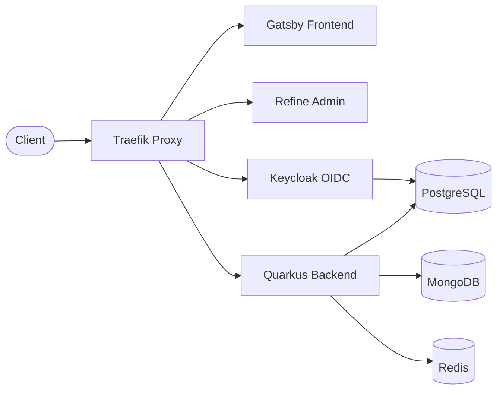
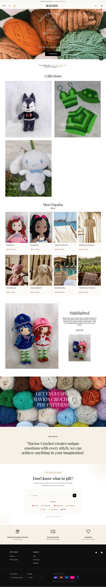
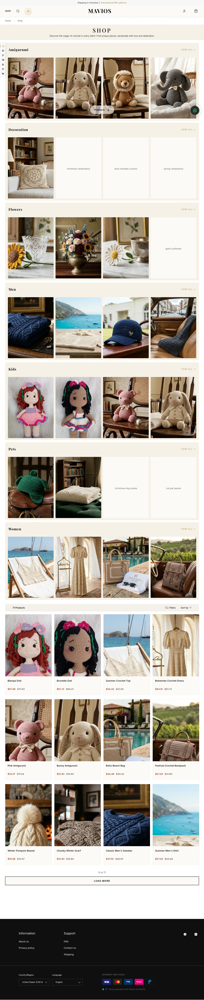
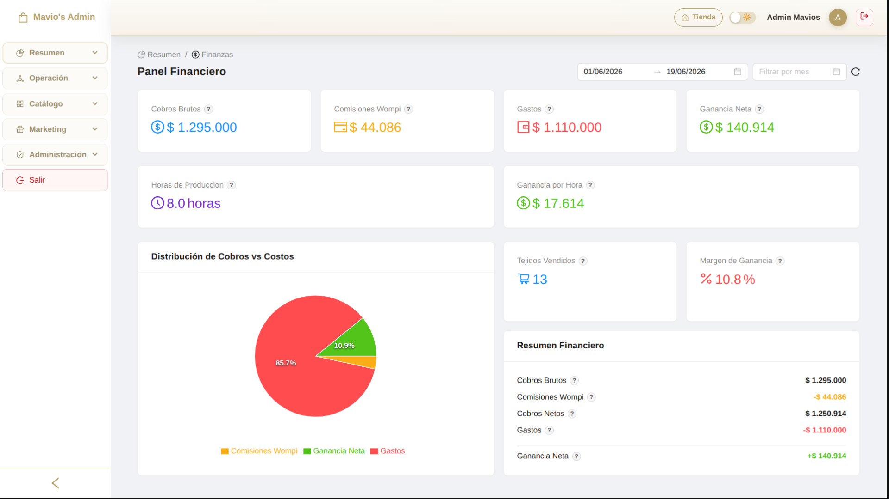
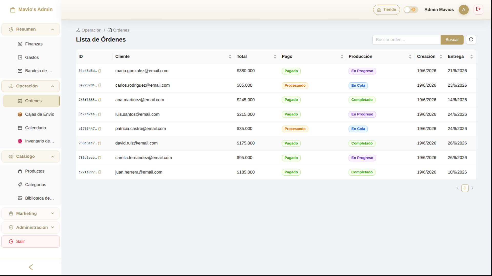
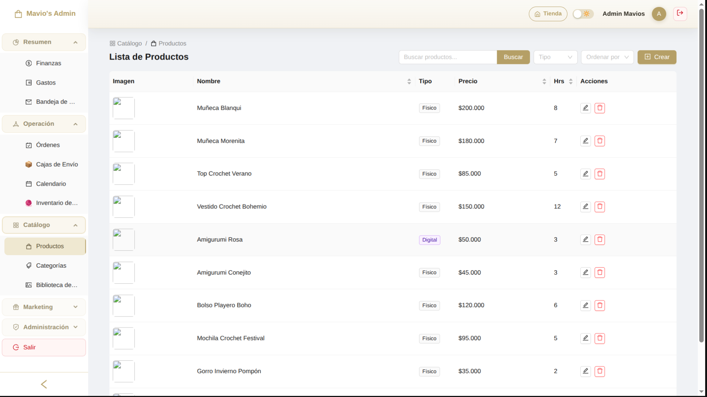
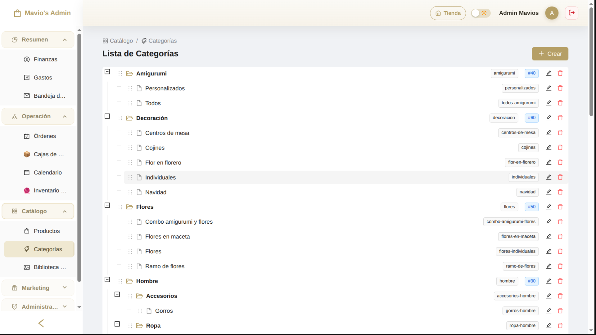
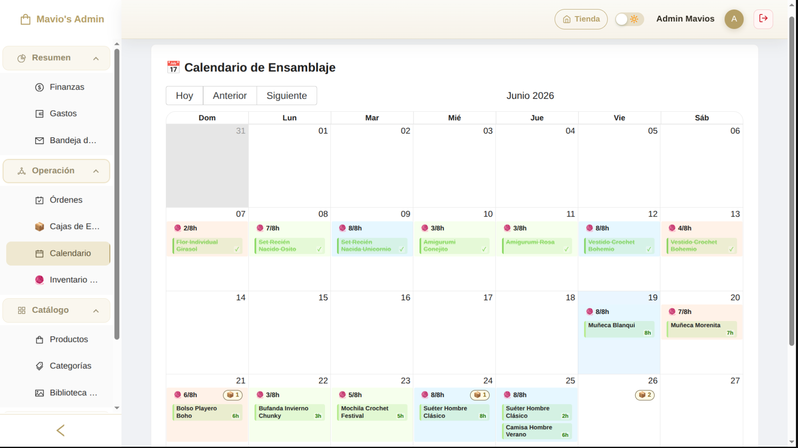
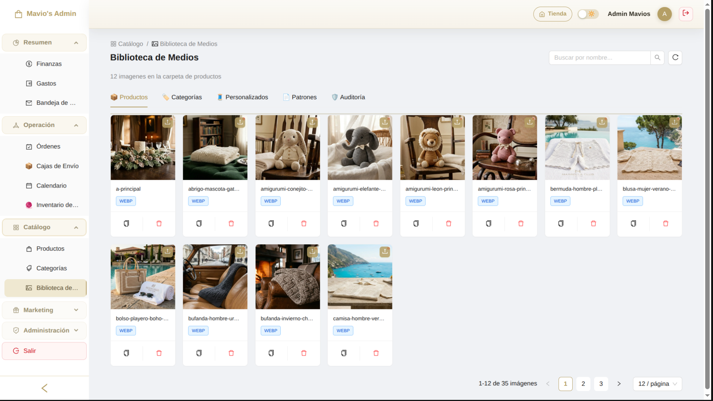
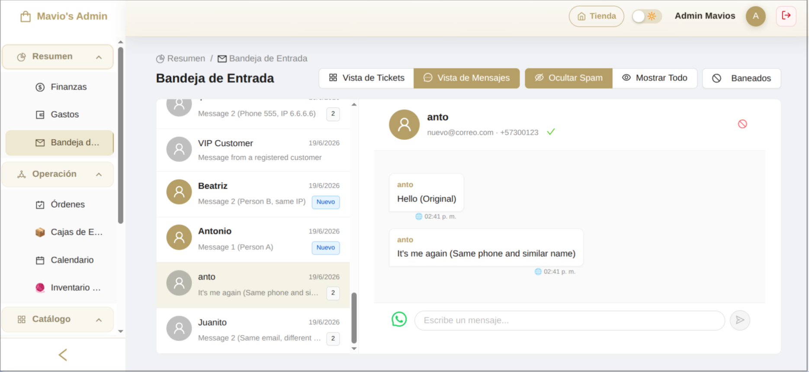

<div style="text-align: center;">

# MaviosCrochet

**White-Label E-Commerce Engine & Full-Stack Platform (PostgreSQL, MongoDB, Redis, Keycloak, Traefik, Grafana, Prometheus)**


[](https://quarkus.io/) 
[](https://www.gatsbyjs.com/) 
[](https://refine.dev/) 
[](https://www.keycloak.org/)
[](https://traefik.io/)

</div>

> 🌐 **[Versión en español (README_ES.md)](README_ES.md)**

---

## 🚀 Overview

MaviosCrochet is a premium full-stack e-commerce platform built on **Pragmatic DDD (Domain-Driven Design)**, **Repository Pattern**, and **Clean Architecture**, adhering strictly to **SOLID** and **DRY** principles. 

The system features an **RFC 7807 compliant error handling** schema (Problem Details) and a pluggable integration layer designed via **Interface Segregation** — ensuring that payment gateways (Wompi, PayPal), cloud storage (Cloudinary), geolocation (Mapbox), shipping (Envía), and OAuth providers (Google) are completely swappable without modifications to the core business logic. 

The platform exposes **+145 REST endpoints and webhook listeners**, coordinated by a self-hosted infrastructure running in production via Docker Compose behind Traefik reverse proxies.

**White-Label E-commerce Engine**: This backend engine is designed as a highly cohesive, headless core capable of seamlessly integrating with multiple custom frontends. It serves as a proprietary, reusable platform to rapidly bootstrap tailored e-commerce solutions for diverse clients.

---

## 🏗️ High-Level Architecture



## ⚡ System Resilience & Load Testing

I rigorously load-tested the backend engine using **k6** and subjected it to property-based fuzzing via **Schemathesis**. During extreme stress tests (spiking to **500 concurrent Virtual Users**), the system maintained a **0.00% error rate** under load. I accomplished this by migrating from standard blocking threads to **Java 21 Virtual Threads** (`@RunOnVirtualThread`), combined with optimized Redis connection pooling and strategic `VirtualThreadPerTaskExecutor` implementations to prevent `ForkJoinPool` starvation during heavy I/O and cryptographic operations.

👉 *[Read the full technical Post-Mortem and Thread Starvation analysis in ARCHITECTURE.md](docs/en/ARCHITECTURE.md#10-system-resilience--load-testing-post-mortem)*

---

## 🎯 Key Features

- **Multi-Gateway Payments** — PayPal, Wompi, and Stripe integration with webhook-driven confirmation and idempotent transaction processing
- **Transactional Idempotency** — Duplicate-safe checkout using `Idempotency-Key` headers with isolated `REQUIRES_NEW` transactions
- **Pessimistic Concurrency Control** — `SELECT FOR UPDATE` locking on order rows to eliminate race conditions during payment capture
- **Event-Driven Architecture (EDA)** — Loosely-coupled modules communicate via domain events (e.g., `OrderPaidEvent`, `OrderReadyEvent`, `ShipmentStatusUpdatedEvent`). The event publisher is fully abstracted over in-memory CDI, allowing a zero-rewrite migration to distributed brokers like **Kafka** or **RabbitMQ** as the system scales.
- **FIFO Capacity Scheduler (Production Calendar)** — Capacity planning system for handcrafted crochet orders that schedules production blocks chronologically by dividing quantities into discrete units, filling daily hour limits, splitting long tasks across consecutive working days, preventing day-level fragmentation, and generating human-readable mnemonic tracking codes (e.g., `#AM-U-DOR-46E6-1`).
- **Shipping Integration & 3D Bin Packing** — Real-time quotes, label generation, pickup scheduling, and tracking via Envía API. Employs a 3D Bin Packing heuristic algorithm that calculates optimal shipping box configurations from active inventories based on product dimensions (with a 20% safety volume slack) or falls back to synthetic cube-root boxes.
- **Yarn Inventory Management** — Stock tracking by type, color, and weight with adjustment history
- **Financial Dashboard** — Revenue summaries, expense tracking, pricing calculator, and USD/COP exchange rate integration
- **Coupon & Discount Engine** — Percentage/fixed discounts with usage limits, expiration dates, and minimum order thresholds
- **Digital Pattern Sales** — PDF watermarking and secure download delivery for crochet patterns
- **Image Management** — Cloudinary-backed upload, optimization, and proxy serving for product, category, and customer reference images
- **Keycloak SSO & Cookie Security** — OAuth2/OIDC proxy integration with Google login and role-based access control. Leverages secure HttpOnly, SameSite=Lax access/refresh tokens in cookies, automatic token rotation on refresh, and absolute session limits for robust security.
- **Security Filter & Threat Mitigation** — IP and user banning system with Redis-cached denial lookups (O(1) `SISMEMBER`) running globally on the request filter level, combined with Redis-backed sliding-window rate limiting (configurable RPM per IP) and suspicious upload review processes.
- **RFC 7807 Error Handling** — Standardized Problem Details responses across all +145 endpoints
- **Full Observability** — Prometheus metrics, Grafana dashboards, and MongoDB audit logging
- **Bilingual Context Negotiation & Unified Inbox** — Core support for English/Spanish contexts using a multi-priority Language Resolver (headers, database profile preferences, order settings) to translate customer communications and template emails. Includes a threaded inbox correlating web form requests and IMAP-synced Gmail messages using a weighted matching score (matching email, phone, IP, and name).

---

## 🖥️ Live Demo

Access the live customer store front and API routes:

- **Customer Storefront**: `https://mavios.tonys-dev.com`
- **API Gateway Gateway**: `https://mavios.tonys-dev.com/api`
- **Admin Dashboard**: `https://mavios.tonys-dev.com/admin`
- **Identity Provider (Keycloak)**: `https://mavios.tonys-dev.com/auth`

---

## 📸 Screenshots

### Customer Storefront
<p>
  
  
</p>

### Admin Dashboard
<p>
  
  
</p>
<p>
  
  
</p>
<p>
  
  
</p>
<p>
  
</p>

---

## 📁 Tech Stack

- **Frontend Customer Store**
  - Gatsby v5 (React 19)
  - TailwindCSS & Framer Motion
  - Localized interface (gatsby-plugin-react-i18next)
  - Mapbox Search SDK for address geolocations

- **Admin Panel**
  - React 19 (Vite 6 + TypeScript)
  - Refine Framework (Ant Design components)
  - Recharts for metrics & analytics visualization

- **Backend API Engine**
  - Quarkus 3.31.1 (Java 21)
  - Keycloak 23 (OpenID Connect / OAuth2 Identity Provider)
  - Hibernate ORM with Panache + JDBC Driver for PostgreSQL
  - MongoDB Java client (Audit trails and raw logging)
  - Redis Client (Local caching and rate limiting)
  - Micrometer + Prometheus Actuator for observability
  - SmallRye OpenAPI (Swagger)

- **Infrastructure & Devops**
  - Traefik (Edge router, TLS resolver, and reverse proxy)
  - PostgreSQL 15 (Relational transactional storage)
  - MongoDB 6 (Audit document logger)
  - Redis 7 (In-memory cache and session state)
  - Prometheus (Scraping engine) & Grafana (Analytics dashboards)
  - Docker & Docker Compose

---

## 🔌 External API Integrations

The system heavily relies on seamless server-to-server and client-to-server integrations to handle payments, logistics, geolocation, and media processing. **Crucially, following Clean Architecture and Hexagonal Design principles, all external APIs are strictly decoupled from the core business logic via Interface Segregation, ensuring that any provider can be swapped out without affecting the domain layer.**

**Backend API Integrations (Quarkus REST Clients)**:
- **[Wompi API](https://wompi.co/)** — Colombian payment gateway for card processing and PSE (Bank Transfers), complete with webhook signature integrity validation (`wompi.events.secret`).
- **[Stripe API](https://stripe.com/)** — International payment processing via credit cards, using Stripe Webhooks for asynchronous order completion.
- **[PayPal REST API](https://developer.paypal.com/)** — Order creation and capturing via PayPal Checkout, synchronized via Webhooks.
- **[Envía API](https://envia.com/)** — Real-time shipping rates (`queries.envia.com`), label generation (`api.envia.com`), and address geocoding (`geocodes.envia.com`).
- **[Cloudinary API](https://cloudinary.com/)** — Secure media upload and dynamic on-the-fly image optimization for product catalog assets.
- **[Google OAuth2](https://developers.google.com/identity/protocols/oauth2)** — Social login integration with Keycloak acting as an Identity Broker.
- **[Gmail IMAP/SMTP](https://developers.google.com/gmail/api)** — Secure SMTP connection for outbound transactional emails and scheduled IMAP polling to build threaded, WhatsApp-style inbox interfaces in the admin panel.
- **[Exchange Rate API](https://www.exchangerate-api.com/)** — Server-side fetching of real-time USD/COP currency conversion rates (`open.er-api.com`) to calculate dynamic pricing.
- **[IPWhoIs API](https://ipwhois.io/)** — Server-side IP geolocation tracking (`ipwho.is`) cached via Redis to dynamically adapt country codes and regional features based on the customer's origin.

**Frontend Client Integrations (React/Gatsby)**:
- **[Mapbox Search SDK](https://www.mapbox.com/)** — Address autocomplete and reverse geocoding on the checkout screen to validate delivery locations.

---

## 📂 Project Structure

Root repository layouts and core components:

```
/ (repo root)
├─ backend/                # Java Quarkus backend web API (Maven)
│  ├─ src/main/java/       # Domain modules (sales, catalog, shipping, production, users)
│  ├─ pom.xml              # Maven dependencies
│  └─ Dockerfile           # Backend container
├─ frontend/               # Gatsby client-facing store
│  ├─ src/                 # Store pages, catalog templates, internationalization
│  └─ Dockerfile
├─ admin/                  # Refine & Ant Design admin portal (Vite + TS)
│  ├─ src/                 # Admin queues, user roles, inventory dashboards
│  └─ Dockerfile
├─ infrastructure/         # self-hosted docker-compose files and configurations
│  ├─ keycloak-realm/      # Keycloak realm configuration imports
│  ├─ prometheus/          # Prometheus scraping rules
│  ├─ nginx/               # Local staging proxies
│  ├─ docker-compose-production.yml
│  └─ docker-compose-staging.yml
├─ docs/                   # Technical documentation
│  ├─ en/                  # 🇺🇸 English documentation
│  └─ es/                  # 🇪🇸 Spanish documentation
└─ README.md               # <- you are here
```

For more details on backend configuration, local packaging, and layers, refer to the **[Backend README](backend/README.md)**.

---

## ✅ Prerequisites

- **Java JDK 21** (for backend API compilation)
- **Node.js >= 18** and **npm**
- **Docker & Docker Compose** (for multi-container deployment)
- **Maven 3.8+** (or use backend `./mvnw`)

---

## 🛠️ Environment & Configuration

MaviosCrochet expects environment variables configured in a `.env` file at the repository root. A sample template is provided in `infrastructure/.env.example`:

```env
# Domain Hostnames
BASE_DOMAIN=tonys-dev.com
VITE_API_URL=https://mavios.tonys-dev.com/api
VITE_FRONTEND_URL=https://mavios.tonys-dev.com

# PostgreSQL Configuration
POSTGRES_DB=mavioscrochet
POSTGRES_USER=postgres
POSTGRES_PASSWORD=secure_postgres_pass

# MongoDB Audit Log Credentials
MONGO_DB=mavios_audit_logs
MONGO_USER=mongo_audit_admin
MONGO_PASSWORD=secure_mongo_pass

# Keycloak Identity Credentials
ADMIN_USER=keycloak_admin
ADMIN_PASSWORD=secure_keycloak_pass
KEYCLOAK_SERVER_URL=https://mavios.tonys-dev.com/auth
```

---

## 🛠️ Local Development Setup

To run the backend locally in development mode (hot-reload):

```bash
# 1. Start required services (PostgreSQL, MongoDB, Redis, Keycloak)
cd infrastructure
docker compose -f docker-compose-staging.yml --env-file .env up -d

# 2. Run the Quarkus backend in dev mode
cd ../backend
./mvnw quarkus:dev

# 3. Run the Gatsby frontend (in a separate terminal)
cd ../frontend
npm install && npm run develop

# 4. Run the admin panel (in a separate terminal)
cd ../admin
npm install && npm run dev
```

| Service | Local URL |
|---------|----------|
| Backend API | `http://localhost:8080` |
| Swagger UI | `http://localhost:8080/q/swagger-ui` |
| Gatsby Frontend | `http://localhost:8000` |
| Admin Panel | `http://localhost:5173` |
| Keycloak | `http://localhost:8180` |

---

## 🚀 Quick Start (Production Setup)

The entire production stack is containerized and managed via Docker Compose behind Traefik.

### Step 1: Create the Proxy Network
Traefik communicates with other web containers through an external Docker network:

```bash
docker network create proxy_network
```

### Step 2: Spin Up the Stack
Run the production compose file to start PostgreSQL, MongoDB, Redis, Keycloak, Traefik, Grafana, Prometheus, the Backend, the Admin Panel, and the Gatsby Frontend:

```bash
cd infrastructure
docker compose -f docker-compose-production.yml --env-file .env up -d --build
```

The system will automatically:
- ✅ Launch Traefik on ports 80/443 and resolve Let's Encrypt certificates.
- ✅ Initialize the databases and run migration scripts.
- ✅ Import the Keycloak realm configuration.
- ✅ Build the Gatsby static frontend.

---

## 🔄 CI/CD & Automated Deployment

I implemented a fully automated CI/CD pipeline using **GitHub Actions**, **GitHub Container Registry (GHCR)**, and **Tailscale VPN** for secure server access.

### 1. Build and Publish (GHCR)
On every push to `main` (production) or `staging` (staging environment), the pipeline triggers automatically. It builds the Docker images for the Backend, Frontend (Gatsby), and Admin panel, and publishes them securely to the private GHCR repository. 

**Build-Time vs Run-Time Variables:**
- During the GitHub build phase, the pipeline injects **build-time variables** (like `GATSBY_API_URL` and `VITE_API_URL`) as Docker `build-args`. This is required for SSG (Static Site Generation) and Vite, as these frontend frameworks hardcode the API endpoints during compilation.
- **Run-time secrets** (like database passwords, Keycloak credentials, and JWT keys) are NOT passed to GitHub Actions. They are safely kept exclusively on the VPS inside the 100+ line `.env` file, ensuring no sensitive production keys leak into the CI environment.

### 2. Secure SSH Deployment
Once the images are published, the GitHub runner connects to the VPS via SSH (secured over a private **Tailscale** overlay network). The runner executes a script on the server that:
- Authenticates with GHCR to access the private images.
- Pulls the latest `docker-compose-production.yml` (or staging) from the repository.
- Pulls the newly built images from GHCR.
- Automatically handles database rollbacks or wipes if it detects core Flyway migration changes (`V1__...`).
- Restarts the Docker Compose services with the new images, picking up the local `.env` file for runtime secrets.

*Note: Changes made strictly to documentation (`*.md` files or `docs/` folder) will bypass the deployment pipeline to save CI minutes and prevent unnecessary server restarts.*

---

## 🔑 Identity & Authentication Flow

- **Identity Provider**: Keycloak manages user authentication, registration, and social logins (Google OAuth2).
- **Security Constraint**: User credentials are never processed directly by the application backend. All requests are authorized using JWT Bearer tokens issued by Keycloak.
- **Role Verification**: The application frontend (Gatsby) and administrative panel (Refine) extract roles directly from decrypted JWT claims, preventing privilege escalation.
- **REST Security**: Quarkus secures endpoints using `@RolesAllowed("admin")` or `@RolesAllowed("customer")` annotations, mapped against OIDC validation keys.

---

## 📚 Observability & Observables

The self-hosted deployment monitors application health and metrics out-of-the-box:
- **Prometheus** scrapes the backend Actuator `/q/metrics` or `/q/health` endpoint, collecting performance details (heap usage, response latencies, DB connection pools).
- **Grafana** is pre-configured with dashboards pointing to Prometheus. You can view it live at `https://mavios.tonys-dev.com/grafana` (auth credentials configured in `.env`).

---

## 🏗️ Architecture Highlights

- **Modular Monolith** — 9 bounded contexts (`sales`, `catalog`, `shipping`, `production`, `inventory`, `finance`, `users`, `security`, `category`) with strict package isolation and zero circular dependencies
- **Hexagonal Architecture** — Domain core defines ports (repository interfaces); infrastructure provides adapters (JPA/Mongo implementations). Business logic never depends on frameworks
- **Domain Events (EDA)** — Cross-module communication via Jakarta CDI `@Observes(during = AFTER_SUCCESS)` events, keeping modules 100% decoupled
- **Idempotent Transactions** — `IdempotencyService` uses `REQUIRES_NEW` isolated transactions to register keys before processing, preventing double charges on concurrent requests
- **Pessimistic Locking** — Payment webhook handlers use `LockModeType.PESSIMISTIC_WRITE` (`SELECT FOR UPDATE`) to safely handle concurrent payment confirmations

> 📘 Full architecture documentation with Mermaid diagrams and SOLID pattern analysis is available in [`docs/en/ARCHITECTURE.md`](docs/en/ARCHITECTURE.md)

---

## 📖 Documentation

Detailed technical documentation is available in the [`docs/`](docs/) directory in both English and Spanish:

| Document | 🇺🇸 English | 🇪🇸 Español |
|----------|-------------|-------------|
| **Architecture Guide** — Design patterns (SOLID, DDD, Hexagonal), event-driven flows, idempotency, and concurrency | [ARCHITECTURE.md](docs/en/ARCHITECTURE.md) | [ARCHITECTURE.md](docs/es/ARCHITECTURE.md) |
| **API Overview** — Complete REST API catalog (+145 endpoints) with methods, routes, descriptions, and auth levels | [API_OVERVIEW.md](docs/en/API_OVERVIEW.md) | [API_OVERVIEW.md](docs/es/API_OVERVIEW.md) |
| **Backend API Guide** — Backend-specific setup, local packaging, directory structures, layer constraints, and test suite | [README.md](backend/README.md) | [README_ES.md](backend/README_ES.md) |

Additionally, the Java source code includes comprehensive Javadoc across all controllers, services, domain entities, repositories, events, and listeners.

---

## 🤝 Contributing

1. Create a feature branch off `main`.
2. Confirm the workspace formatting guidelines (Prettier / Java formatting) are followed.
3. Verify that the backend compiles and all tests pass:
   ```bash
   cd backend && ./mvnw clean compile
   cd backend && ./mvnw clean test
   ```
4. Review the [Architecture Guide](docs/en/ARCHITECTURE.md) to understand the modular structure and coding patterns.
5. Follow the existing Javadoc conventions when adding new classes.

---

## 👨‍💻 Author

**Tony S.**
*Full-Stack Software Engineer*
- [LinkedIn](https://linkedin.com/in/tonys-dev)
- [GitHub](https://github.com/tonys-dev)

*Engineered from scratch to serve as a robust, scalable backend for modern web applications.*

---

## 📄 License

This project is **proprietary software**. All rights reserved. See [LICENSE](LICENSE) for details.

The source code, architecture, and all associated materials are the exclusive intellectual property of the copyright holder. Access to this repository does not constitute a license or grant of rights to use, reproduce, or distribute the software.
