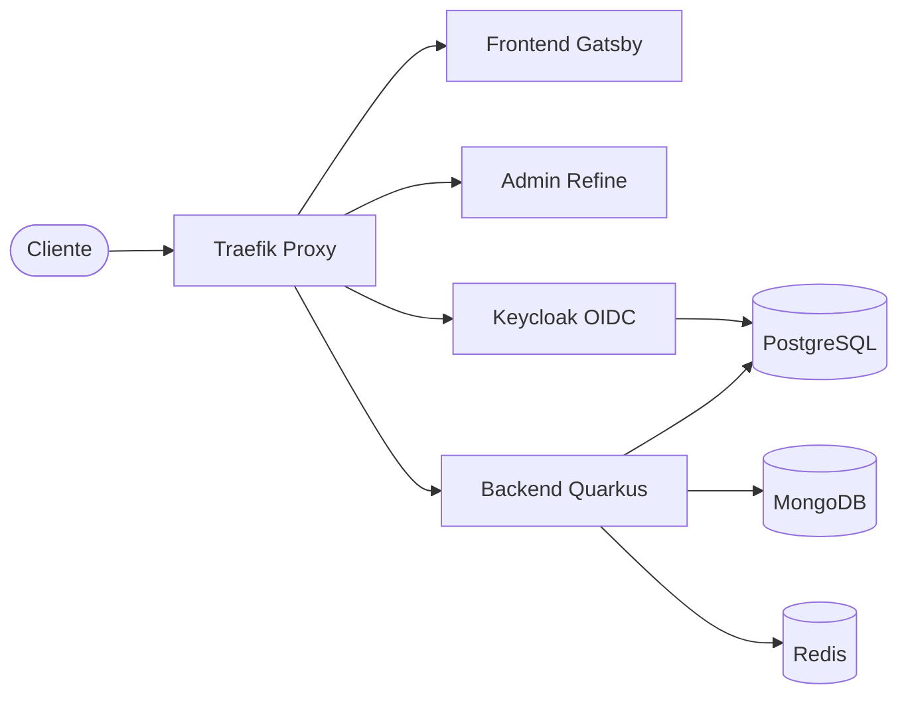

<div style="text-align: center;">

# MaviosCrochet

**Motor E-Commerce de Marca Blanca y Plataforma Full-Stack (PostgreSQL, MongoDB, Redis, Keycloak, Traefik, Grafana, Prometheus)**


[](https://quarkus.io/) 
[](https://www.gatsbyjs.com/) 
[](https://refine.dev/) 
[](https://www.keycloak.org/)
[](https://traefik.io/)

</div>

> 🌐 **[English version (README.md)](README.md)**

---

## 🚀 Descripción General

MaviosCrochet es una plataforma e-commerce full-stack premium construida sobre **DDD Pragmático (Domain-Driven Design)**, **Repository Pattern** y **Clean Architecture**, adhiriendo estrictamente a los principios **SOLID** y **DRY**.

El sistema cuenta con un esquema de **manejo de errores compatible con RFC 7807** (Problem Details) y una capa de integración modular e intercambiable (pluggable) diseñada mediante **Segregación de Interfaces** — asegurando que las pasarelas de pago (Wompi, PayPal), almacenamiento en la nube (Cloudinary), geolocalización (Mapbox), envíos (Envía) y proveedores OAuth (Google) sean completamente intercambiables sin modificaciones a la lógica de negocio.

La plataforma expone **+145 endpoints REST y listeners de webhooks**, coordinados por una infraestructura auto-alojada que corre en producción mediante Docker Compose detrás de proxies reversos Traefik.

**Motor E-Commerce de Marca Blanca (Headless)**: Este backend está diseñado como un núcleo headless altamente cohesivo, capaz de integrarse de manera fluida con múltiples frontends personalizados. Funciona como una plataforma propietaria y reutilizable para arrancar rápidamente soluciones de e-commerce a la medida para diversos clientes.

---

## 🏗️ Arquitectura de Alto Nivel



## ⚡ Resiliencia del Sistema y Pruebas de Carga (Load Testing)

Sometí el motor del backend a rigurosas pruebas de estrés utilizando **k6** y auditorías de fuzzing basado en propiedades mediante **Schemathesis**. Durante pruebas de estrés extremo (picos de **500 Usuarios Virtuales concurrentes**), el sistema mantuvo una **tasa de error del 0.00%**. Conseguí esto migrando de hilos bloqueantes estándar a **Hilos Virtuales de Java 21** (`@RunOnVirtualThread`), combinado con un pooling optimizado de conexiones Redis e implementaciones estratégicas de `VirtualThreadPerTaskExecutor` para prevenir el *Thread Starvation* (inanición) del `ForkJoinPool` durante operaciones intensivas de I/O y criptografía.

👉 *[Lee el Post-Mortem técnico completo y el análisis de Thread Starvation en ARCHITECTURE.md](docs/es/ARCHITECTURE.md#10-resiliencia-del-sistema-y-pruebas-de-carga-post-mortem)*

---

## 🎯 Funcionalidades Clave

- **Pagos Multi-Pasarela** — Integración con PayPal, Wompi y Stripe con confirmación por webhooks y procesamiento de transacciones idempotente
- **Idempotencia Transaccional** — Checkout a prueba de duplicados usando headers `Idempotency-Key` con transacciones aisladas `REQUIRES_NEW`
- **Control de Concurrencia Pesimista** — Bloqueo `SELECT FOR UPDATE` en filas de órdenes para eliminar condiciones de carrera durante la captura de pagos
- **Arquitectura Orientada a Eventos (EDA)** — Módulos débilmente acoplados que se comunican mediante eventos de dominio (ej. `OrderPaidEvent`, `OrderReadyEvent`, `ShipmentStatusUpdatedEvent`). El publicador de eventos está totalmente abstraído sobre CDI en memoria, permitiendo una migración transparente (zero-rewrite) a brokers distribuidos como **Kafka** o **RabbitMQ** a medida que el sistema escale.
- **Planificador de Capacidad FIFO (Calendario de Producción)** — Sistema de planificación de capacidad para órdenes de crochet artesanal que programa bloques de producción cronológicamente (FIFO) dividiendo cantidades en unidades individuales, llenando límites de horas diarias, dividiendo tareas largas en días laborales consecutivos, evitando la fragmentación diaria y generando códigos de seguimiento mnemotécnicos legibles por humanos (ej., `#AM-U-DOR-46E6-1`).
- **Integración de Envíos y Empaque de Cajas 3D (3D Bin Packing)** — Cotizaciones en tiempo real, generación de guías, programación de recolección y tracking vía API de Envía. Emplea un algoritmo heurístico de empaquetado de cajas en 3D que calcula configuraciones de cajas óptimas desde el inventario basándose en las dimensiones del producto (con un margen de volumen de seguridad del 20%) u opta por cajas cúbicas sintéticas calculadas mediante raíz cúbica.
- **Gestión de Inventario de Hilos** — Seguimiento de stock por tipo, color y peso con historial de ajustes
- **Dashboard Financiero** — Resúmenes de ingresos, seguimiento de gastos, calculadora de precios e integración de tasa de cambio USD/COP
- **Motor de Cupones y Descuentos** — Descuentos porcentuales/fijos con límites de uso, fechas de expiración y umbrales mínimos de orden
- **Venta de Patrones Digitales** — Marca de agua en PDFs y entrega segura de descargas para patrones de crochet
- **Gestión de Imágenes** — Upload respaldado por Cloudinary, optimización y servido proxy para imágenes de productos, categorías y referencias de clientes
- **Keycloak SSO y Seguridad de Cookies** — Integración proxy OAuth2/OIDC con login de Google y control de acceso basado en roles. Aprovecha cookies seguras HttpOnly y SameSite=Lax para tokens de acceso y refresco (access/refresh tokens), con rotación automática de tokens de refresco y tiempos de sesión absolutos para una seguridad robusta.
- **Filtro de Seguridad y Mitigación de Amenazas** — Sistema de baneo global de usuarios y direcciones IP con lookups de denegación cacheados en Redis (O(1) `SISMEMBER`) a nivel de filtro de peticiones HTTP, combinado con rate limiting basado en ventana deslizante en Redis (RPM configurable por IP) y flujo de auditoría/revisión para imágenes subidas.
- **Manejo de Errores RFC 7807** — Respuestas estandarizadas Problem Details en los +145 endpoints
- **Observabilidad Completa** — Métricas Prometheus, dashboards Grafana y logging de auditoría en MongoDB
- **Negociación de Contexto Bilingüe y Bandeja Unificada** — Soporte nativo para contextos de idioma (EN/ES) con un resolvedor de lenguaje multi-prioridad (headers del navegador, perfil de usuario en base de datos o preferencias del checkout de la orden) para traducir correos e interacciones. Incluye una bandeja de entrada que unifica solicitudes de formularios web y correos de Gmail (IMAP) mediante una puntuación de coincidencia ponderada (coincidencia de email, teléfono, IP y nombre).

---

Accede a la tienda del cliente y las rutas de la API:

- **Tienda del Cliente**: `https://mavios.tonys-dev.com`
- **API Gateway**: `https://mavios.tonys-dev.com/api`
- **Panel de Administración**: `https://mavios.tonys-dev.com/admin`
- **Proveedor de Identidad (Keycloak)**: `https://mavios.tonys-dev.com/auth`

---

## 📸 Capturas de Pantalla

### Tienda del Cliente
<p>
  
  
</p>

### Panel de Administración
<p>
  
  
</p>
<p>
  
  
</p>
<p>
  
  
</p>
<p>
  
</p>

---

## 📁 Stack Tecnológico

- **Tienda del Cliente (Frontend)**
  - Gatsby v5 (React 19)
  - TailwindCSS & Framer Motion
  - Interfaz localizada (gatsby-plugin-react-i18next)
  - Mapbox Search SDK para geolocalizaciones de direcciones

- **Panel Administrativo**
  - React 19 (Vite 6 + TypeScript)
  - Refine Framework (componentes Ant Design)
  - Recharts para métricas y visualización analítica

- **Motor API Backend**
  - Quarkus 3.31.1 (Java 21)
  - Keycloak 23 (Proveedor de Identidad OpenID Connect / OAuth2)
  - Hibernate ORM con Panache + Driver JDBC para PostgreSQL
  - Cliente MongoDB Java (Auditoría y logging sin procesar)
  - Cliente Redis (Caché local y rate limiting)
  - Micrometer + Prometheus Actuator para observabilidad
  - SmallRye OpenAPI (Swagger)

- **Infraestructura y DevOps**
  - Traefik (Router de borde, resolutor TLS y proxy reverso)
  - PostgreSQL 15 (Almacenamiento relacional transaccional)
  - MongoDB 6 (Logger de documentos de auditoría)
  - Redis 7 (Caché en memoria y estado de sesión)
  - Prometheus (Motor de scraping) & Grafana (Dashboards analíticos)
  - Docker & Docker Compose

---

## 🔌 Integración con APIs Externas

El sistema se apoya fuertemente en integraciones server-to-server y client-to-server de terceros para manejar pagos, logística, geolocalización y procesamiento de medios. **De manera crucial, siguiendo los principios de Clean Architecture y Diseño Hexagonal, todas las APIs externas están estrictamente desacopladas de la lógica central del negocio mediante la Segregación de Interfaces, asegurando que cualquier proveedor pueda ser reemplazado sin afectar la capa de dominio.**

**Integraciones del Backend (Clientes REST en Quarkus)**:
- **[API de Wompi](https://wompi.co/)** — Pasarela de pagos colombiana para tarjetas y PSE (Transferencias Bancarias), con validación de integridad de firmas en webhooks (`wompi.events.secret`).
- **[API de Stripe](https://stripe.com/)** — Procesamiento de pagos internacionales con tarjetas de crédito, usando Webhooks de Stripe para completar órdenes asincrónicamente.
- **[API REST de PayPal](https://developer.paypal.com/)** — Creación y captura de órdenes vía PayPal Checkout, sincronizado a través de Webhooks.
- **[API de Envía](https://envia.com/)** — Cotización de envíos en tiempo real (`queries.envia.com`), generación de guías (`api.envia.com`) y geocodificación de direcciones (`geocodes.envia.com`).
- **[API de Cloudinary](https://cloudinary.com/)** — Subida segura de medios y optimización dinámica de imágenes en tiempo real para los recursos del catálogo.
- **[Google OAuth2](https://developers.google.com/identity/protocols/oauth2)** — Integración de login social delegando la identidad mediante Keycloak como Identity Broker.
- **[Gmail IMAP/SMTP](https://developers.google.com/gmail/api)** — Conexión SMTP segura para correos transaccionales de salida y polling IMAP programado para construir interfaces de bandeja de entrada estilo WhatsApp en el panel de administración.
- **[API de Tasas de Cambio](https://www.exchangerate-api.com/)** — Consulta desde el backend de las tasas de conversión USD/COP en tiempo real (`open.er-api.com`) para el cálculo dinámico de precios.
- **[API de IPWhoIs](https://ipwhois.io/)** — Detección de geolocalización por IP en el servidor (`ipwho.is`) cacheada mediante Redis para adaptar dinámicamente códigos de país y features regionales según el origen del cliente.

**Integraciones del Frontend (React/Gatsby)**:
- **[Mapbox Search SDK](https://www.mapbox.com/)** — Autocompletado de direcciones y geocodificación inversa en la pantalla de checkout para validar las ubicaciones de entrega.

---

## 📂 Estructura del Proyecto

Distribución del repositorio raíz y componentes principales:

```
/ (raíz del repositorio)
├─ backend/                # API web Java Quarkus (Maven)
│  ├─ src/main/java/       # Módulos de dominio (sales, catalog, shipping, production, users)
│  ├─ pom.xml              # Dependencias Maven
│  └─ Dockerfile           # Contenedor del backend
├─ frontend/               # Tienda cliente Gatsby
│  ├─ src/                 # Páginas, plantillas de catálogo, internacionalización
│  └─ Dockerfile
├─ admin/                  # Portal admin Refine & Ant Design (Vite + TS)
│  ├─ src/                 # Colas admin, roles de usuario, dashboards de inventario
│  └─ Dockerfile
├─ infrastructure/         # Archivos docker-compose y configuraciones auto-alojadas
│  ├─ keycloak-realm/      # Importaciones de configuración del realm de Keycloak
│  ├─ prometheus/          # Reglas de scraping de Prometheus
│  ├─ nginx/               # Proxies de staging local
│  ├─ docker-compose-production.yml
│  └─ docker-compose-staging.yml
├─ docs/                   # Documentación técnica
│  ├─ en/                  # 🇺🇸 Documentación en inglés
│  └─ es/                  # 🇪🇸 Documentación en español
└─ README.md               # <- estás aquí
```

Para más detalles sobre la configuración, empaquetado y módulos del backend, consulta el **[README del Backend](backend/README_ES.md)**.

---

## ✅ Prerrequisitos

- **Java JDK 21** (para compilación del API backend)
- **Node.js >= 18** y **npm**
- **Docker & Docker Compose** (para despliegue multi-contenedor)
- **Maven 3.8+** (o usar el wrapper del backend `./mvnw`)

---

## 🛠️ Entorno y Configuración

MaviosCrochet espera variables de entorno configuradas en un archivo `.env` en la raíz del repositorio. Una plantilla de ejemplo está disponible en `infrastructure/.env.example`:

```env
# Hostnames de Dominio
BASE_DOMAIN=tonys-dev.com
VITE_API_URL=https://mavios.tonys-dev.com/api
VITE_FRONTEND_URL=https://mavios.tonys-dev.com

# Configuración de PostgreSQL
POSTGRES_DB=mavioscrochet
POSTGRES_USER=postgres
POSTGRES_PASSWORD=secure_postgres_pass

# Credenciales de MongoDB para Auditoría
MONGO_DB=mavios_audit_logs
MONGO_USER=mongo_audit_admin
MONGO_PASSWORD=secure_mongo_pass

# Credenciales de Identidad en Keycloak
ADMIN_USER=keycloak_admin
ADMIN_PASSWORD=secure_keycloak_pass
KEYCLOAK_SERVER_URL=https://mavios.tonys-dev.com/auth
```

---

## 🛠️ Configuración de Desarrollo Local

Para ejecutar el backend localmente en modo desarrollo (hot-reload):

```bash
# 1. Iniciar servicios requeridos (PostgreSQL, MongoDB, Redis, Keycloak)
cd infrastructure
docker compose -f docker-compose-staging.yml --env-file .env up -d

# 2. Ejecutar el backend Quarkus en modo desarrollo
cd ../backend
./mvnw quarkus:dev

# 3. Ejecutar el frontend Gatsby (en una terminal separada)
cd ../frontend
npm install && npm run develop

# 4. Ejecutar el panel admin (en una terminal separada)
cd ../admin
npm install && npm run dev
```

| Servicio | URL Local |
|----------|-----------|
| Backend API | `http://localhost:8080` |
| Swagger UI | `http://localhost:8080/q/swagger-ui` |
| Frontend Gatsby | `http://localhost:8000` |
| Panel Admin | `http://localhost:5173` |
| Keycloak | `http://localhost:8180` |

---

## 🚀 Inicio Rápido (Configuración de Producción)

Todo el stack de producción está containerizado y gestionado mediante Docker Compose detrás de Traefik.

### Paso 1: Crear la Red del Proxy
Traefik se comunica con los otros contenedores web a través de una red Docker externa:

```bash
docker network create proxy_network
```

### Paso 2: Levantar el Stack
Ejecuta el archivo compose de producción para iniciar PostgreSQL, MongoDB, Redis, Keycloak, Traefik, Grafana, Prometheus, el Backend, el Panel Admin y el Frontend Gatsby:

```bash
cd infrastructure
docker compose -f docker-compose-production.yml --env-file .env up -d --build
```

El sistema automáticamente:
- ✅ Lanza Traefik en los puertos 80/443 y resuelve certificados Let's Encrypt.
- ✅ Inicializa las bases de datos y ejecuta scripts de migración.
- ✅ Importa la configuración del realm de Keycloak.
- ✅ Construye el frontend estático de Gatsby.

---

## 🔄 CI/CD y Despliegue Automatizado

Implementé un pipeline de CI/CD completamente automatizado usando **GitHub Actions**, **GitHub Container Registry (GHCR)** y **Tailscale VPN** para un acceso seguro al servidor.

### 1. Construcción y Publicación (GHCR)
En cada push a `main` (producción) o `staging` (entorno de pruebas), el pipeline se dispara automáticamente. Construye las imágenes de Docker para el Backend, Frontend (Gatsby) y el Panel Admin, y las publica de forma segura en el repositorio privado de GHCR.

**Variables en Tiempo de Construcción vs Tiempo de Ejecución:**
- Durante la fase de build en GitHub, el pipeline inyecta **variables de tiempo de construcción** (como `GATSBY_API_URL` y `VITE_API_URL`) usando `build-args` de Docker. Esto es obligatorio para SSG (Static Site Generation) y Vite, ya que estos frameworks de frontend incrustan las rutas de las APIs durante la compilación.
- Los **secretos de ejecución** (como contraseñas de base de datos, credenciales de Keycloak y llaves JWT) NO se envían a GitHub Actions. Se mantienen de forma segura y exclusiva en el VPS dentro del archivo `.env` de más de 100 líneas, garantizando que ninguna clave de producción se filtre en el entorno de CI.

### 2. Despliegue Seguro por SSH
Una vez publicadas las imágenes, el runner de GitHub se conecta al VPS por SSH (asegurado mediante una red privada virtual de **Tailscale**). El runner ejecuta un script en el servidor que:
- Se autentica con GHCR para acceder a las imágenes privadas.
- Descarga la última versión del `docker-compose-production.yml` (o staging) del repositorio.
- Descarga las imágenes recién construidas desde GHCR.
- Maneja automáticamente los reinicios de bases de datos si detecta cambios en las migraciones base de Flyway (`V1__...`).
- Reinicia los servicios de Docker Compose con las nuevas imágenes, leyendo el `.env` local para obtener los secretos de ejecución.

*Nota: Los cambios realizados estrictamente a la documentación (archivos `*.md` o la carpeta `docs/`) ignorarán el pipeline de despliegue para ahorrar minutos de CI y prevenir reinicios innecesarios del servidor.*

---

## 🔑 Flujo de Identidad y Autenticación

- **Proveedor de Identidad**: Keycloak gestiona la autenticación de usuarios, registro y logins sociales (Google OAuth2).
- **Restricción de Seguridad**: Las credenciales de usuario nunca son procesadas directamente por el backend. Todas las peticiones son autorizadas usando tokens JWT Bearer emitidos por Keycloak.
- **Verificación de Roles**: El frontend (Gatsby) y el panel administrativo (Refine) extraen los roles directamente de los claims JWT desencriptados, previniendo escalamiento de privilegios.
- **Seguridad REST**: Quarkus asegura los endpoints usando anotaciones `@RolesAllowed("admin")` o `@RolesAllowed("customer")`, mapeadas contra las claves de validación OIDC.

---

## 📚 Observabilidad

El despliegue auto-alojado monitorea la salud de la aplicación y métricas de forma automática:
- **Prometheus** escanea el endpoint Actuator del backend `/q/metrics` o `/q/health`, recolectando detalles de rendimiento (uso de heap, latencias de respuesta, pools de conexiones a BD).
- **Grafana** viene preconfigurado con dashboards apuntando a Prometheus. Puedes verlo en vivo en `https://mavios.tonys-dev.com/grafana` (credenciales configuradas en `.env`).

---

## 🏗️ Aspectos Arquitectónicos Clave

- **Monolito Modular** — 9 contextos acotados (`sales`, `catalog`, `shipping`, `production`, `inventory`, `finance`, `users`, `security`, `category`) con aislamiento estricto de paquetes y cero dependencias circulares
- **Arquitectura Hexagonal** — El core de dominio define puertos (interfaces de repositorio); la infraestructura provee adaptadores (implementaciones JPA/Mongo). La lógica de negocio nunca depende de frameworks
- **Eventos de Dominio (EDA)** — Comunicación entre módulos vía Jakarta CDI `@Observes(during = AFTER_SUCCESS)`, manteniendo los módulos 100% desacoplados
- **Transacciones Idempotentes** — `IdempotencyService` usa transacciones aisladas `REQUIRES_NEW` para registrar claves antes del procesamiento, previniendo cobros dobles en peticiones concurrentes
- **Bloqueo Pesimista** — Los handlers de webhooks de pago usan `LockModeType.PESSIMISTIC_WRITE` (`SELECT FOR UPDATE`) para manejar de forma segura confirmaciones de pago concurrentes

> 📘 Documentación completa de arquitectura con diagramas Mermaid y análisis de patrones SOLID disponible en [`docs/es/ARCHITECTURE.md`](docs/es/ARCHITECTURE.md)

---

## 📖 Documentación

Documentación técnica detallada disponible en el directorio [`docs/`](docs/):

| Documento | Descripción |
|-----------|-------------|
| 🇺🇸 [**ARCHITECTURE.md**](docs/en/ARCHITECTURE.md) | Guía de arquitectura en inglés |
| 🇺🇸 [**API_OVERVIEW.md**](docs/en/API_OVERVIEW.md) | Catálogo completo de la API REST en inglés |
| 🇺🇸 [**backend/README.md**](backend/README.md) | Guía técnica y de desarrollo específica del backend en inglés |
| 🇪🇸 [**ARCHITECTURE.md**](docs/es/ARCHITECTURE.md) | Guía de arquitectura con diagramas Mermaid, patrones de diseño (SOLID, DDD, Hexagonal), flujos de eventos, y estrategias de idempotencia y concurrencia |
| 🇪🇸 [**API_OVERVIEW.md**](docs/es/API_OVERVIEW.md) | Catálogo completo de la API REST — los +145 endpoints organizados por módulo con métodos HTTP, rutas, descripciones y requisitos de autenticación |
| 🇪🇸 [**backend/README_ES.md**](backend/README_ES.md) | Guía de desarrollo del Backend — capas de arquitectura limpia, configuración de base de datos híbrida y comandos de ejecución/compilación |

Además, el código fuente Java incluye Javadoc exhaustivo en todos los controllers, services, entidades de dominio, repositorios, eventos y listeners.

---

## 🤝 Contribuir

1. Crea un feature branch desde `main`.
2. Confirma que las guías de formato del workspace (Prettier / Java formatting) sean seguidas.
3. Verifica que el backend compile y todas las pruebas pasen:
   ```bash
   cd backend && ./mvnw clean compile
   cd backend && ./mvnw clean test
   ```
4. Revisa la [Guía de Arquitectura](docs/es/ARCHITECTURE.md) para entender la estructura modular y los patrones de código.
5. Sigue las convenciones de Javadoc existentes al agregar nuevas clases.

---

## 👨‍💻 Autor

**Tony S.**
*Ingeniero de Software Full-Stack*
- [LinkedIn](https://linkedin.com/in/tonys-dev)
- [GitHub](https://github.com/tonys-dev)

*Construido desde cero para servir como un backend robusto y escalable para aplicaciones web modernas.*

---

## 📄 Licencia

Este proyecto es **software propietario**. Todos los derechos reservados. Ver [LICENSE](LICENSE) para más detalles.

El código fuente, la arquitectura y todos los materiales asociados son propiedad intelectual exclusiva del titular de los derechos de autor. El acceso a este repositorio no constituye una licencia ni otorga derechos para usar, reproducir o distribuir el software.
