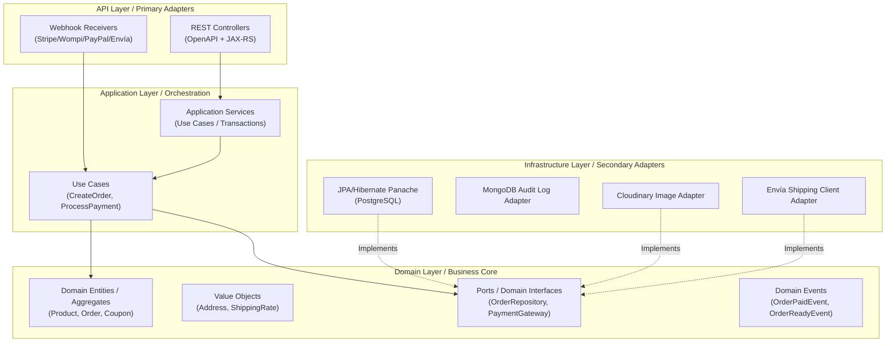
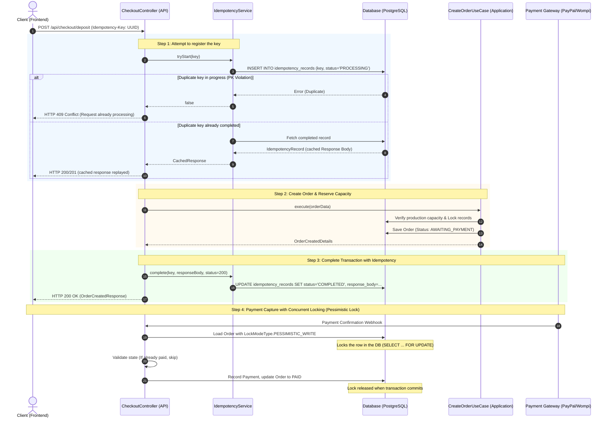
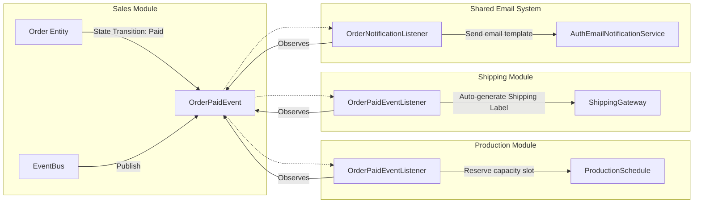
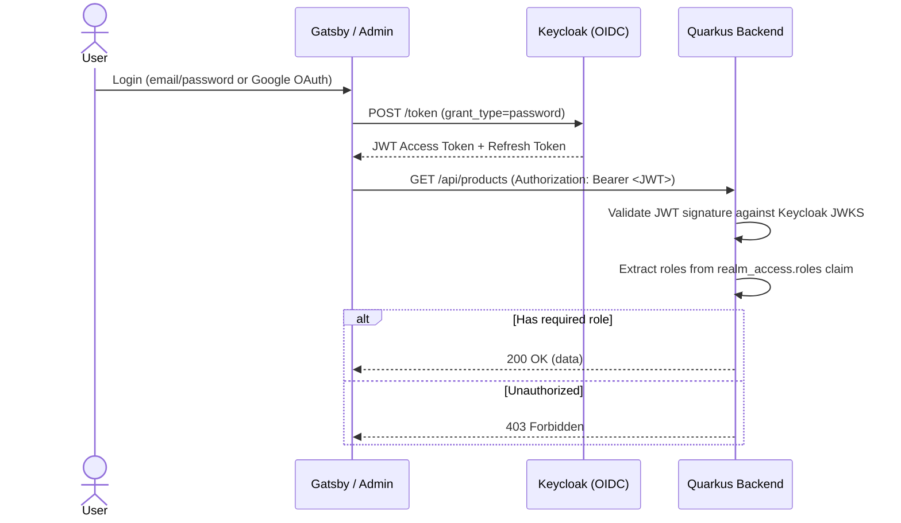
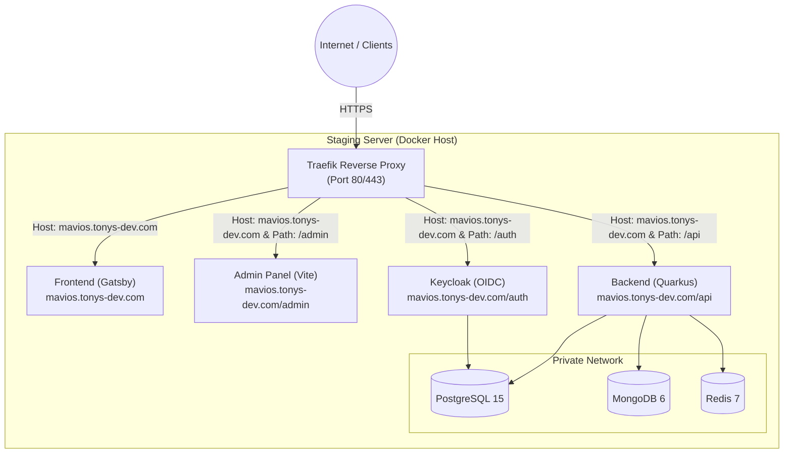
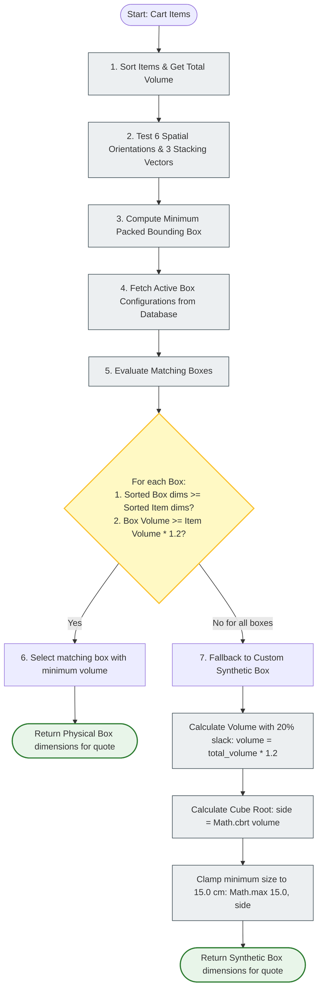
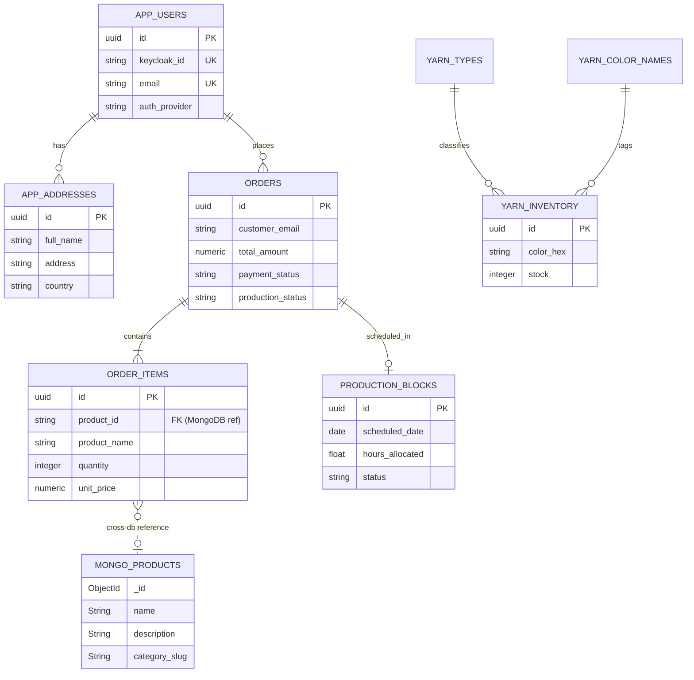

# Architecture & Technical Design — MaviosCrochet

This technical guide details the software architecture, design patterns, and engineering decisions implemented in the **MaviosCrochet** backend. It is designed to serve as reference material for code reviews, developer onboarding, and system design meetings.

---

## 1. Architectural Pattern: Modular Monolith with Pragmatic DDD

I structured the system as a **Modular Monolith** following **Domain-Driven Design (DDD)** principles. Each module represents a *Bounded Context* of the business domain and has its own physical isolation in the codebase, preventing circular dependencies and unnecessary coupling.

### System Bounded Contexts

| Module | Business Context | Responsibility |
|--------|-----------------|----------------|
| `catalog` | Product Catalog | Product management, images, colors, sizes, tags, and wishlists |
| `category` | Categorization | Hierarchical category tree for products |
| `sales` | Sales & Checkout | Cart, checkout, orders, coupons, payments (PayPal/Wompi), and webhooks |
| `shipping` | Shipping | Quotes, tracking, shipping boxes, and Envía webhooks |
| `production` | Production | Crochet calendar, production blocks, and capacity configuration |
| `inventory` | Inventory | Yarn stock control, types, and colors |
| `finance` | Finance | Financial summaries, expenses, exchange rates, and pricing calculator |
| `users` | Users & Auth | Registration, login, OAuth, addresses, contact, and admin management |
| `security` | Security | IP/user bans, suspicious upload management |

### Layer Overview (Hexagonal Architecture / Ports & Adapters)

I structured each module with a clean architecture in three main layers:



### Package Structure per Module

Each bounded context follows the same consistent internal structure:

```
modules/{name}/
├── api/                   # REST Controllers (primary adapters)
│   ├── admin/             # Admin-protected endpoints
│   └── webhooks/          # External webhook receivers
├── core/
│   ├── application/       # Application services and use cases
│   │   └── admin/         # Administrative logic
│   └── domain/            # Entities, Value Objects, and Ports (interfaces)
│       ├── model/         # JPA entities and enums
│       └── repository/    # Repository interfaces (ports)
└── infrastructure/
    └── persistence/       # JPA/Mongo Panache implementations (adapters)
```

### Application Layer Design: Facade + Command/Use Case Pattern

To prevent services from bloating into large, unmaintainable monolithic classes (such as the original `OrderService.java` which exceeded 1000 lines), I separated the business orchestration in MaviosCrochet into **dedicated Use Case interactors**:
- **Granular Interactors**: Core actions reside in single-purpose classes like `CreateOrderUseCase`, `ProcessPaymentUseCase`, `SettleBalancePayment`, and `OrderQueryService`. Each contains a single entry point matching the Command Pattern.
- **Facade Orchestrator**: The high-level `OrderService` class acts as a clean facade. It injects the specific use cases and exposes them as simple, unified API delegation hooks.
- **Benefits**:
  - **Single Responsibility Principle (SRP)**: Each interactor has only a single reason to change, maximizing unit-testing speed and code scanability.
  - **Open/Closed Principle (OCP)**: Adding new order-related commands (e.g. pre-ordering or cancellation use cases) requires creating new interactor classes rather than modifying a bloated 1000-line service.
  - **Microservices Readiness**: Because use cases map directly to business transactions, extracting a module (like Sales) into a separate microservice can be done with minimal refactoring.

---

## 2. Complete Transaction Flow: Checkout with Idempotency & Concurrent Locking

This flow details the sequence that guarantees **"At-Most-Once"** processing during checkout, using the idempotency record system (`Idempotency-Key`) and pessimistic database locks (`PESSIMISTIC_WRITE`) to prevent duplicate charges and race conditions.



---

## 3. Domain Event-Driven Architecture (EDA)

To keep modules decoupled, I implemented internal communication between Bounded Contexts using **Domain Events** distributed within the transaction, instead of direct cross-dependency injection.



### Key Domain Events in the Order Lifecycle

1. **`OrderPaidEvent`**: Triggers the formal reservation of crochet hours in the production calendar, generates the draft shipping label, and sends the purchase confirmation email to the customer.
2. **`OrderReadyEvent`**: Indicates that the crocheter has completed the product. Triggers automatic packaging and shipping label PDF generation.
3. **`ShipmentStatusUpdatedEvent`**: Published when the shipping carrier (Envía API webhooks) reports a location change (e.g., *In Transit*, *Delivered*, or *Wrong Address*).

### Technical Mechanism

Events use the Jakarta EE CDI system (`jakarta.enterprise.event.Event`):

```java
// Publishing (in the Sales module)
@Inject Event<OrderPaidEvent> orderPaidEvent;
orderPaidEvent.fire(new OrderPaidEvent(order));

// Transactional observation (in the Production module)
public void onOrderPaid(@Observes(during = TransactionPhase.AFTER_SUCCESS) OrderPaidEvent event) {
    productionScheduleService.reserveCapacity(event.getOrder());
}
```

---

## 4. Applied Design Patterns & SOLID Principles

### 1. Dependency Inversion Principle (DIP) & Ports & Adapters
The core application logic (domain layer / use cases) never depends on external libraries or database implementation details.
- **The Port**: `OrderRepository` (Interface in the Domain layer).
- **The Adapter**: `JpaOrderRepository` (Implementation in the Infrastructure layer).
- **Benefit**: If you decide to switch from PostgreSQL to MongoDB for orders, you only rewrite the adapter. The business logic (`CreateOrderUseCase`) remains untouched.

### 2. Single Responsibility Principle (SRP) & Idempotency
The logic to prevent duplicate submissions does not pollute checkout controllers or order services.
- The controller delegates idempotency persistence to `IdempotencyService` and order creation to `CreateOrderUseCase`.
- Each class has a single axis of change.

### 3. Interface Segregation Principle (ISP) in Shipping Clients
Instead of having a single monolithic interface for interacting with Envía, contracts are split into small services:
- `ShippingGateway`: Exclusively handles shipping quotes and label generation.
- `EnviaWebhookService`: Exclusively handles parsing and validating signatures from incoming notifications.

### 4. Open/Closed Principle (OCP) in Payment Gateways
The system supports multiple payment gateways (PayPal, Wompi, Stripe) without modifying existing checkout logic. Each gateway implements its own controller and service, connecting to the same `Order` flow through `PaymentWebhookController`.

### 5. Ports & Adapters for External API Decoupling (Gateway Pattern)
External integrations never pollute the core business modules. All third-party services are fully isolated:
- **Payment Gateways**: Interface `PaymentGateway` is the domain Port; implementations for PayPal and Wompi are Adapters inside the infrastructure package.
- **Shipping Services**: Interface `ShippingGateway` is the Port; `EnviaShippingGateway` is the Adapter.
- **Geolocation**: `GeoService` acts as a port, resolving geocodes without business logic caring whether Mapbox or another provider is used.
- **Exchange Rates**: `ExchangeRateClient` is the Port; the actual REST client querying external exchange rates is the Adapter.
- **Media Uploads**: `ImageService` acts as the Port; `CloudinaryImageService` implements it as the Adapter.

This strict decoupling ensures that if an external provider modifies its API or changes its pricing, we only modify the specific Adapter class, leaving the core application and domain modules completely untouched.

```mermaid
graph TD
    subgraph CoreDomain ["Core Domain / Application Layer"]
        usecase["Business Use Cases<br>(e.g. ProcessPayment, ShipOrder)"]
        
        %% Ports
        portPayment["PaymentGateway (Port)"]
        portShipping["ShippingGateway (Port)"]
        portGeo["GeoService (Port)"]
        portImage["ImageService (Port)"]
        portExchange["ExchangeRateClient (Port)"]
        
        usecase --> portPayment
        usecase --> portShipping
        usecase --> portGeo
        usecase --> portImage
        usecase --> portExchange
    end

    subgraph Infrastructure ["Infrastructure Layer (Adapters)"]
        %% Payment Adapters
        adapterPaypal["PaypalGatewayAdapter"]
        adapterWompi["WompiGatewayAdapter"]
        adapterStripe["StripeGatewayAdapter"]
        
        %% Shipping Adapter
        adapterEnvia["EnviaShippingAdapter"]
        
        %% Geo Adapter
        adapterMapbox["MapboxGeoAdapter"]
        
        %% Image Adapter
        adapterCloudinary["CloudinaryImageAdapter"]
        
        %% Exchange Rate Adapter
        adapterExchange["ExchangeRateApiAdapter"]
        
        %% Implements relations
        adapterPaypal -.->|Implements| portPayment
        adapterWompi -.->|Implements| portPayment
        adapterStripe -.->|Implements| portPayment
        
        adapterEnvia -.->|Implements| portShipping
        adapterMapbox -.->|Implements| portGeo
        adapterCloudinary -.->|Implements| portImage
        adapterExchange -.->|Implements| portExchange
    end

    %% External APIs
    apiPaypal["PayPal REST API"]
    apiWompi["Wompi API"]
    apiStripe["Stripe API"]
    apiEnvia["Envía.com API"]
    apiMapbox["Mapbox Search API"]
    apiCloudinary["Cloudinary API"]
    apiExchange["ExchangeRate API"]

    adapterPaypal --> apiPaypal
    adapterWompi --> apiWompi
    adapterStripe --> apiStripe
    adapterEnvia --> apiEnvia
    adapterMapbox --> apiMapbox
    adapterCloudinary --> apiCloudinary
    adapterExchange --> apiExchange

    classDef port fill:#e8f5e9,stroke:#2e7d32,stroke-width:2px;
    classDef adapter fill:#eceff1,stroke:#37474f,stroke-width:2px;
    classDef external fill:#fff3e0,stroke:#ef6c00,stroke-width:1px,stroke-dasharray: 5 5;
    
    class portPayment,portShipping,portGeo,portImage,portExchange port;
    class adapterPaypal,adapterWompi,adapterStripe,adapterEnvia,adapterMapbox,adapterCloudinary,adapterExchange adapter;
    class apiPaypal,apiWompi,apiStripe,apiEnvia,apiMapbox,apiCloudinary,apiExchange external;
```




---

## 5. Persistence Stack

| Technology | Usage | Justification |
|------------|-------|---------------|
| **PostgreSQL** (Hibernate Panache) | Transactional data (orders, products, users) | Referential integrity, ACID transactions, pessimistic locking |
| **MongoDB** | Audit logs and audit records | Flexible documents, schema-less, fast writes for telemetry |
| **Redis** | Session cache and rate limiting | Low latency, automatic key expiration |

---

## 6. Security & Authentication



- **Cookie-Based Stateless Authentication**: Instead of passing tokens in authorization headers (which can be vulnerable to local storage XSS theft), tokens are exchanged and written directly into HTTP response cookies from the `/login`, `/register`, and `/google/callback` endpoints:
  - `accessToken`: Stores the Keycloak-issued JWT token. Marked as `HttpOnly`, `Secure` (in production), and `SameSite=Lax`.
  - `refreshToken`: Stores the OIDC rotation refresh token. Used in the `/refresh` endpoint to generate a new access token, returning a new rotated refresh token on each request.
- **CSRF & XSS Protection**: By using `HttpOnly` flags, the browser prevents JavaScript from reading the tokens, blocking XSS-based session hijacking. `SameSite=Lax` ensures cookies are transmitted on initial navigation from OAuth identity providers (Google/Keycloak redirects).
- **Session Duration Constraints**: Cookie lifetime is bound strictly to the `expiresIn` and `refreshExpiresIn` properties defined in Keycloak. When a user requests `/logout`, the cookies are immediately overwritten with `maxAge(0)` to invalidate the client session.
- **Global Security Interceptor (`SecurityFilter`)**: Protects the API gateway layer. It intercepts incoming JAX-RS requests at a high priority (`AUTHENTICATION - 10`). It resolves the client's IP address (handling proxy headers) and checks for active bans against a Redis-cached SET (`SISMEMBER`, O(1) microseconds) backed by the `BannedIpRepository`. If the IP is not banned, a Redis-backed sliding-window rate limiter (`INCR` + `EXPIRE`, configurable RPM) throttles excessive requests per IP, returning `429 Too Many Requests` with a `Retry-After` header. If the client is authenticated, it additionally checks if the Keycloak Subject has been marked as suspended in the database. When a threat is detected, the request is aborted immediately with a `403 Forbidden` response, safeguarding resource endpoints.
- **Role-Based Access Control (RBAC)**: Enforced via annotations:
  - `@RolesAllowed("admin")`: Administrative and support panels.
  - `@RolesAllowed("customer")`: Order histories, address settings, profile updates.
  - Public endpoints: Product catalog, category listings, exchange rates, public contact form.

---

## 7. Deployment Topology (Docker & Traefik)

I deploy the platform using Docker Compose with **Traefik** acting as an Edge Router and Reverse Proxy. This architecture allows multiple services to run on the same virtual machine while automatically handling SSL/TLS termination and hostname routing.



- **Traefik**: Intercepts all incoming traffic, terminates SSL via Let's Encrypt, and routes to the correct Docker container based on the `Host` header.
- **Private Network**: PostgreSQL, MongoDB, and Redis are not exposed to the internet. They are only accessible by the Backend and Keycloak containers within the internal Docker network.

---

## 8. Advanced Algorithmic Implementations

I implemented custom algorithms in the backend to optimize operations, schedule artisan labor, and correlate asynchronous messages:

### 1. 3D Bin Packing Heuristic (Shipping Box Calculations)
To determine exact carrier rates during checkout, `ShippingManager` calculates optimal packaging dimensions:
- **Spatial Orientations & Stacking**: Evaluates 6 physical orientations (permutations of Length, Width, Height) and 3 stacking direction vectors (along Length, Width, or Height) using a greedy heuristic. It returns the orientation that minimizes the total bounding box volume.
- **Inventory Box Matching**: Searches active `ShippingBox` configurations. A box is considered a match if its dimensions (sorted from smallest to largest) can contain the items' sorted bounding box dimensions, and if its total volume exceeds the total item volume by at least 1.2x (20% volume safety buffer).
- **Synthetic Fallback**: If no physical box can hold the items, the system generates a custom synthetic box. It calculates the required volume with safety slack, computes the cube root (`Math.cbrt(volume)`) to establish a cubic length, and adds standard cardboard weight (minimum dimensions set to 15cm).




### 2. FIFO In-Memory Production Calendar (Capacity Scheduler)
To allocate slots in the production schedule for handcrafted crochet items:
- **Database Load Minimization**: Performs a single aggregate database query (`sumHoursGroupedByDate`) to fetch all bookings from today onward. All allocation loops run entirely in RAM, preventing transaction thread locks during calculations.
- **Discrete Unit Partitioning**: Quantities are divided into individual physical units. A quantity of 3 triggers 3 separate schedules rather than a single merged block, ensuring granular capacity slots.
- **Chronological Date Packing**: Allocates units to dates starting from tomorrow. If a unit's hour requirement exceeds the remaining daily capacity limit, it splits the work into a chunk and places the remainder on the next working day.
- **Fragmentation Avoidance**: The date cursor only advances to the next working day when the current day is completely full (capacity <= 0).
- **Mnemonic Code Generation**: Creates human-readable tracking codes like `#AM-U-DOR-46E6-1`. It extracts initials from the product name (filtering out common Spanish stop words), upper-cases size, takes the first 3 letters of color, appends the last 4 characters of the order ID, and suffix-codes the unit index.

### 3. Unified Thread Inbox & Transaction-Decoupled Gmail Synchronization
- **Weighted Threat/Inbox Threading**: To unify messages from contact forms and inbound emails into consolidated customer threads, `ContactService` scores incoming requests against a rolling window of recent support messages. It applies a weighted match score:
  - Match on email (case-insensitive): **+60 points** (Threshold target).
  - Match on normalized phone digits: **+45 points**.
  - Match on client IP address: **+30 points**.
  - Match on name substring: **+15 points**.
  - Any total score `>= 60` merges the message into the matching thread; otherwise, a new UUID is generated.
- **Decoupled IMAP Connection Polling**: To fetch emails without blocking database connection pools, `GmailInboundService` executes IMAP queries and parses MIME/multipart envelopes entirely outside active transactions. Only deduplicated messages (`existsByGmailMessageId`) initiate database transactions to save records.
- **Email Spam Blocking**: Integrates a `GmailBlockedSenderRepository`. Senders flagged from the support dashboard are blocked locally, preventing the synchronization worker from downloading or processing future emails from those addresses.

### 4. Locale Context Negotiation Chain
The `LanguageResolver` determines the request language preference (defaulting to `"es"`) using a cascading chain:
1. Explicit request query parameter or JSON payload language override.
2. Saved order locale associated with the checkout session.
3. Authenticated customer's profile preference saved in the local database.
4. Lazily resolved Keycloak realm profile preference.
5. Parser checking the HTTP `Accept-Language` browser header.
6. System default fallback (`"es"`).

---

## 9. RFC 7807 Standardized Error Handling Scheme

To ensure a consistent, predictable REST API client experience, I implemented a centralized exception handling architecture based on the **RFC 7807 (Problem Details for HTTP APIs)** standard:

- **Unified Error Structure**: Instead of exposing raw Java stack traces, database constraint errors, or different format JSON structures, all exceptions map to a standard JSON object containing:
  - `type`: URI identifying the specific problem type (defaults to `about:blank`).
  - `title`: Short, human-readable summary of the problem.
  - `status`: HTTP status code.
  - `detail`: Detailed description of what went wrong (e.g. which validation field failed).
  - `instance`: URI reference to the specific request path that caused the error.

- **Centralized Exception Mappers**: Implemented as JAX-RS `@Provider` classes in the `shared` module:
  - `BusinessExceptionMapper`: Handles custom business rule failures (HTTP 400).
  - `ResourceNotFoundExceptionMapper`: Automatically converts entity-not-found database errors to HTTP 404.
  - `ConflictExceptionMapper`: Maps state check conflicts to HTTP 409.
  - `ValidationExceptionMapper`: Catches Jakarta Bean Validation constraint violations (e.g. `@NotNull`, `@Size`) and groups them into detailed lists showing exactly which input body parameters failed.
  - `GlobalExceptionMapper`: Catches all unexpected runtime exceptions (HTTP 500), logs them safely for auditing, and returns a sanitized Problem Details payload to mitigate information disclosure vulnerabilities.

---

## 10. Core Entity-Relationship Diagram (ERD)

To provide a high-level overview of how the domains connect, here is a simplified ERD demonstrating the relationships between Customers, Orders, Payments, and Inventory.



## 11. CI/CD Pipeline & DevOps

I implemented a fully automated Continuous Integration and Continuous Deployment (CI/CD) pipeline using **GitHub Actions**.

### Continuous Integration (CI)
Through the CI pipeline (`ci.yml`), I automated the following steps for every Push or Pull Request to `main` or `staging`:
1. **Explicit Infrastructure Orchestration**: I disabled automatic Testcontainers (DevServices) to instead explicitly provision a multi-container environment (PostgreSQL, MongoDB, Redis) via a dedicated `docker-compose.ci.yml`, closely mirroring production topology.
2. **Test Execution**: I configured the pipeline to run the complete backend test suite (JUnit 5 + REST Assured) against the orchestrated containers.
3. **Validation**: I ensured integrity by validating the `package-lock.json` dependency tree for both the Frontend (Gatsby) and Admin (Refine).

### Continuous Deployment (CD)
When a push merges into `main`, the CD pipeline (`cd-production.yml`) executes my deployment flow:
1. Builds optimized Docker images for Backend, Frontend, and Admin.
2. Pushes the images to the **GitHub Container Registry (GHCR)**.
3. Establishes a secure VPN tunnel to the production VPS using **Tailscale**.
4. Executes a remote SSH script to pull the latest images and perform a zero-downtime rolling restart via Docker Compose.

---

## 12. System Resilience & Load Testing (Post-Mortem)

To ensure production readiness, I subjected the system to rigorous stress testing using **k6** and property-based fuzzing with **Schemathesis**.

During the initial load test targeting the heaviest endpoint (`POST /api/shipping/quote` — which involves 3D Bin Packing algorithms, JWT validation, Redis rate limiting, and external Envía API calls), I encountered a significant bottleneck under a load of 500 concurrent Virtual Users (VUs): **Thread Starvation**.

### The Problem: ForkJoinPool Exhaustion
Initially, migrating the endpoint from standard blocking threads to Java 21 Virtual Threads (`@RunOnVirtualThread`) yielded unexpected HTTP 500 errors. Analysis of the thread dumps revealed that the default `ForkJoinPool` carrier threads were becoming pinned and starved. This occurred because of aggressive synchronous I/O and cryptographic operations (JWT validation) blocking the underlying carrier threads, leaving no available threads to mount new Virtual Threads. Furthermore, the Redis connection pool exhausted its capacity trying to handle the massive influx of rate-limiting checks.

### The Solution
To achieve a **0.00% error rate** under extreme load, I implemented the following architectural interventions:
1. **Executor Segregation**: Heavy computational and blocking tasks were offloaded from the default `ForkJoinPool` to a dedicated `VirtualThreadPerTaskExecutor`. This isolated the heavy lifting and prevented the main carrier pool from stalling.
2. **Redis Pool Tuning**: The Redis connection pool sizing was dynamically adjusted to accommodate the high concurrency required by the global sliding-window rate limiter.
3. **Optimized I/O**: External HTTP calls (Envía API) were fine-tuned using asynchronous REST clients, maximizing the yielding capabilities of Virtual Threads.

These optimizations allowed Quarkus to gracefully handle 500+ concurrent connections with sub-second latencies and zero dropped requests, proving the immense scalability of the **Virtual Threads + Clean Architecture** combination.
