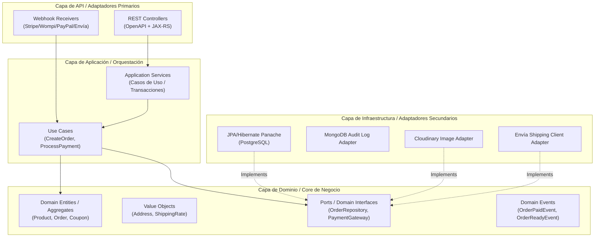
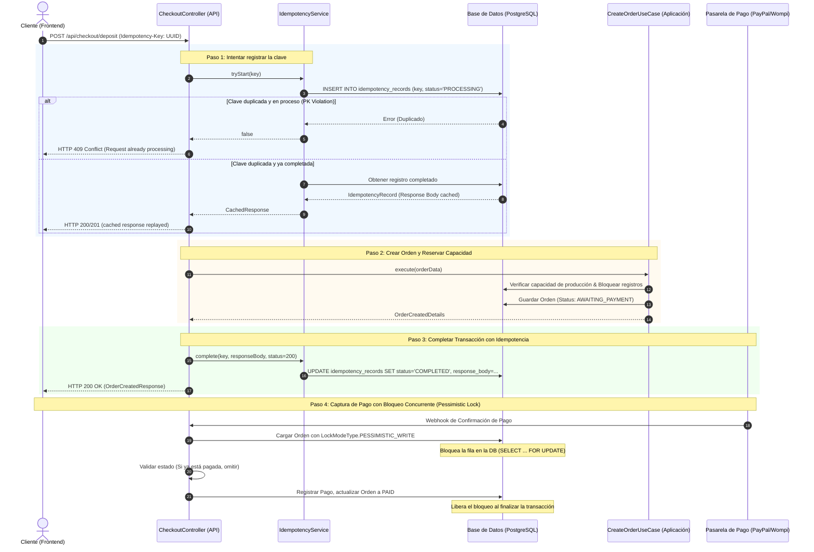
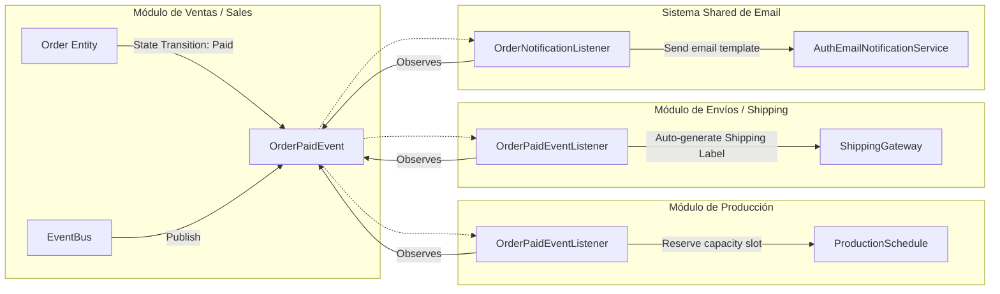
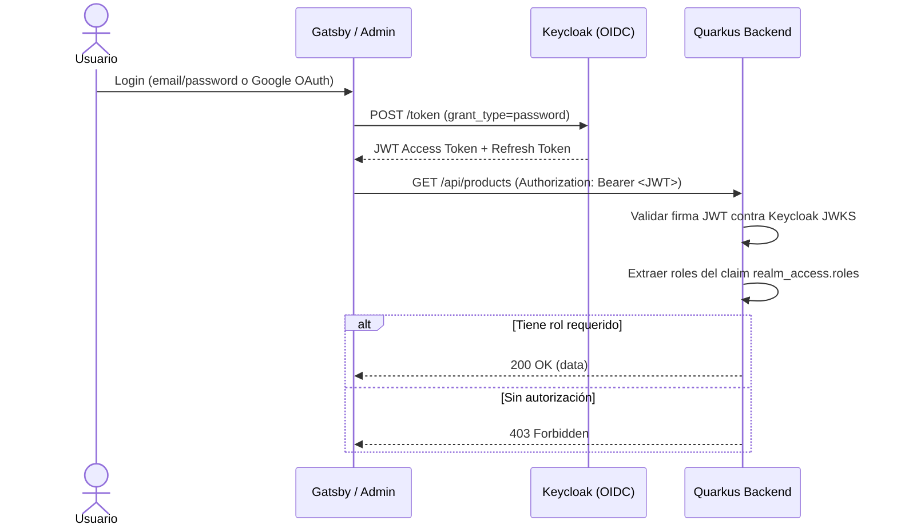
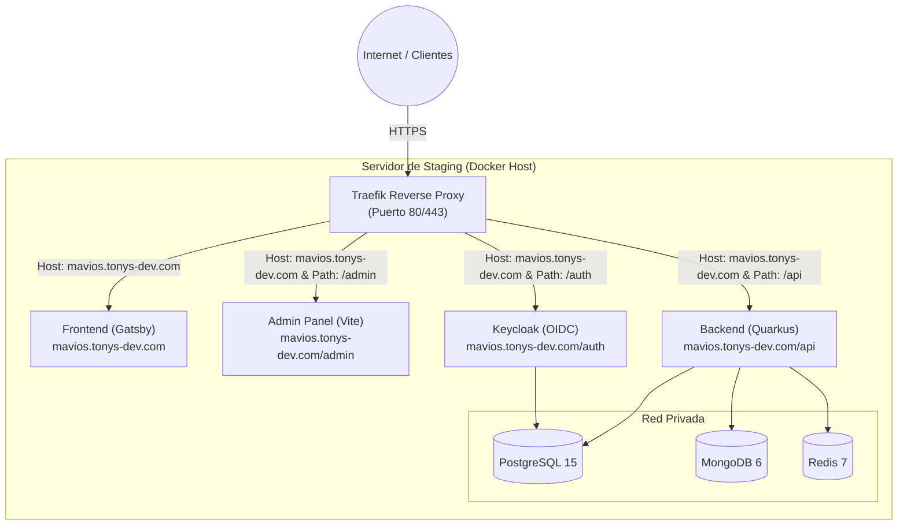
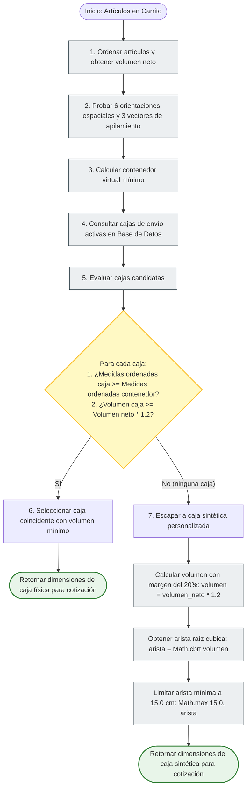
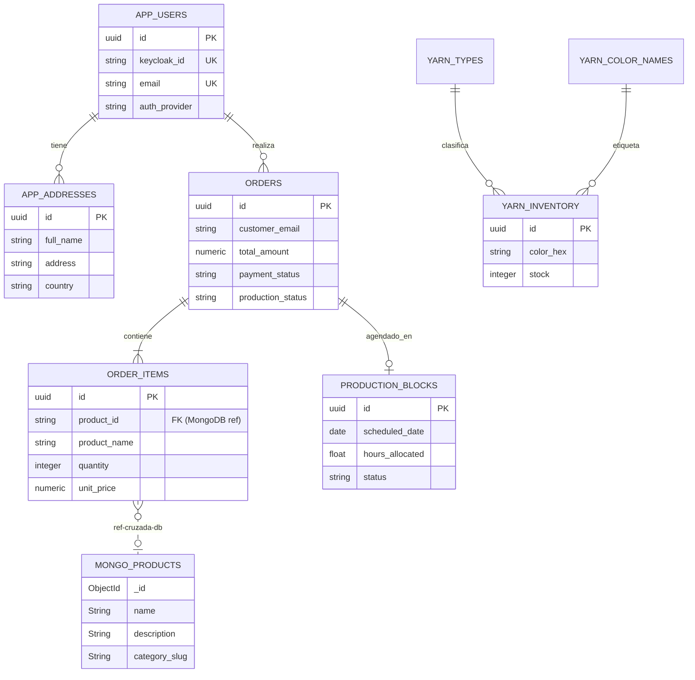

# Arquitectura y Diseño Técnico — MaviosCrochet

Esta guía técnica detalla la arquitectura de software, patrones de diseño y decisiones de ingeniería implementadas en el backend de **MaviosCrochet**. Está diseñada para servir como material de referencia en revisiones de código, inducciones técnicas a desarrolladores o reuniones de diseño de sistemas.

---

## 1. Patrón Arquitectónico: Monolito Modular con DDD Pragmático

Estructuré el sistema como un **Monolito Modular** siguiendo principios de **Domain-Driven Design (DDD)**. Cada módulo representa un *Bounded Context* (Contexto Acotado) del negocio y tiene su propio aislamiento físico en el código, evitando dependencias circulares y acoplamientos innecesarios.

### Bounded Contexts del Sistema

| Módulo | Contexto del Negocio | Responsabilidad |
|--------|----------------------|-----------------|
| `catalog` | Catálogo de Productos | Gestión de productos, imágenes, colores, tallas, tags y wishlists |
| `category` | Categorización | Árbol jerárquico de categorías de productos |
| `sales` | Ventas y Checkout | Carrito, checkout, órdenes, cupones, pagos (PayPal/Wompi) y webhooks |
| `shipping` | Envíos | Cotizaciones, tracking, cajas de envío y webhooks de Envía |
| `production` | Producción | Calendario de tejido, bloques de producción y configuración de capacidad |
| `inventory` | Inventario | Control de stock de hilos, tipos y colores |
| `finance` | Finanzas | Resúmenes financieros, gastos, tasas de cambio y calculadora de precios |
| `users` | Usuarios y Autenticación | Registro, login, OAuth, direcciones, contacto y administración |
| `security` | Seguridad | Baneos de IP/usuario, gestión de uploads sospechosos |

### Vista General de Capas (Arquitectura Hexagonal / Puertos y Adaptadores)

Estructuré cada módulo con una arquitectura limpia en tres capas principales:



### Estructura de Paquetes por Módulo

Cada bounded context sigue la misma estructura interna consistente:

```
modules/{nombre}/
├── api/                   # Controllers REST (adaptadores primarios)
│   ├── admin/             # Endpoints protegidos para administradores
│   └── webhooks/          # Receptores de webhooks externos
├── core/
│   ├── application/       # Servicios de aplicación y casos de uso
│   │   └── admin/         # Lógica administrativa
│   └── domain/            # Entidades, Value Objects y Puertos (interfaces)
│       ├── model/         # Entidades JPA y enums
│       └── repository/    # Interfaces de repositorio (puertos)
└── infrastructure/
    └── persistence/       # Implementaciones JPA/Mongo Panache (adaptadores)
```

### Diseño de la Capa de Aplicación: Patrón Fachada + Casos de Uso/Comando

Para evitar que los servicios crezcan hasta convertirse en clases monolíticas difíciles de mantener (como el `OrderService.java` original que superaba las 1000 líneas), separé la orquestación del negocio en MaviosCrochet en **interactores de Casos de Uso dedicados**:
- **Interactores Granulares**: Las acciones principales residen en clases de un solo propósito como `CreateOrderUseCase`, `ProcessPaymentUseCase`, `SettleBalancePayment` y `OrderQueryService`. Cada una contiene un único punto de entrada, alineándose con el Patrón Comando.
- **Orquestador Fachada**: La clase de alto nivel `OrderService` actúa como una fachada limpia. Inyecta los casos de uso específicos y los expone como ganchos de delegación de API simples y unificados.
- **Beneficios**:
  - **Principio de Responsabilidad Única (SRP)**: Cada interactor tiene una única razón para cambiar, optimizando la velocidad de las pruebas unitarias y la legibilidad del código.
  - **Principio Abierto/Cerrado (OCP)**: Agregar nuevos comandos relacionados con órdenes (ej., casos de uso para pre-órdenes o cancelaciones) requiere crear nuevas clases de interactor en lugar de modificar un servicio sobrecargado de 1000 líneas.
  - **Preparación para Microservicios**: Debido a que los casos de uso mapean directamente a transacciones de negocio, la extracción de un módulo (como Ventas/Sales) hacia un microservicio independiente puede realizarse con una refactorización mínima.

---

## 2. Flujo de Transacción Completo: Checkout con Idempotencia y Bloqueo Concurrente

Este flujo detalla la secuencia que garantiza el procesamiento **"At-Most-Once" (Como máximo una vez)** durante el checkout, utilizando el sistema de registro de idempotencia (`Idempotency-Key`) y bloqueos pesimistas en base de datos (`PESSIMISTIC_WRITE`) para evitar sobrecargos y duplicados.



---

## 3. Arquitectura Dirigida por Eventos de Dominio (EDA)

Para mantener desacoplados los módulos, implementé la comunicación interna entre Bounded Contexts a través de **Eventos de Dominio** distribuidos en la transacción, en lugar de inyección directa de dependencias cruzadas.



### Eventos de Dominio Clave en el Ciclo de Vida

1. **`OrderPaidEvent`**: Dispara la reserva formal de horas de tejido en el calendario de producción, genera el borrador de la guía de envío y envía el correo de confirmación de compra al cliente.
2. **`OrderReadyEvent`**: Indica que el tejedor ha completado el producto. Dispara el empaquetado automático y la generación del PDF de la etiqueta de envío.
3. **`ShipmentStatusUpdatedEvent`**: Publicado cuando la pasarela de transporte (Envía API webhooks) reporta un cambio de ubicación (Ej: *En Tránsito*, *Entregado* o *Dirección Incorrecta*).

### Mecanismo Técnico

Los eventos usan el sistema CDI de Jakarta EE (`jakarta.enterprise.event.Event`):

```java
// Publicación (en el módulo de Sales)
@Inject Event<OrderPaidEvent> orderPaidEvent;
orderPaidEvent.fire(new OrderPaidEvent(order));

// Observación transaccional (en el módulo de Production)
public void onOrderPaid(@Observes(during = TransactionPhase.AFTER_SUCCESS) OrderPaidEvent event) {
    productionScheduleService.reserveCapacity(event.getOrder());
}
```

---

## 4. Patrones de Diseño Aplicados y Principios SOLID

### 1. Inversión de Dependencias (DIP) y Puertos & Adaptadores
La lógica central de la aplicación (capa de dominio/casos de uso) nunca depende de librerías externas o detalles de la base de datos.
- **El Puerto (Port)**: `OrderRepository` (Interface en la capa de Dominio).
- **El Adaptador (Adapter)**: `JpaOrderRepository` (Implementación en la capa de Infraestructura).
- **Beneficio**: Si se decide cambiar PostgreSQL por MongoDB para las órdenes, solo se reescribe el adaptador. La lógica de negocio (`CreateOrderUseCase`) permanece intacta.

### 2. Principio de Responsabilidad Única (SRP) e Idempotencia
La lógica para evitar envíos dobles no contamina los controladores de checkout ni los servicios de orden.
- El controlador delega la persistencia de la idempotencia al `IdempotencyService` y la creación de la orden a `CreateOrderUseCase`.
- Cada clase tiene un único eje de cambio.

### 3. Segregación de Interfaces (ISP) en Clientes de Envío
En lugar de tener una única interfaz gigante para interactuar con Envía, se separan los contratos en servicios pequeños:
- `ShippingGateway`: Se encarga exclusivamente de cotizaciones y etiquetas de envío.
- `EnviaWebhookService`: Se encarga exclusivamente del parseo y validación de las firmas entrantes de las notificaciones.

### 4. Principio Abierto/Cerrado (OCP) en Pasarelas de Pago
El sistema soporta múltiples pasarelas de pago (PayPal, Wompi, Stripe) sin modificar la lógica de checkout existente. Cada pasarela implementa su propio controlador y servicio, conectándose al mismo flujo de `Order` a través de `PaymentWebhookController`.

### 5. Puertos y Adaptadores para el Desacoplamiento de APIs Externas (Patrón Gateway)
Las integraciones externas nunca contaminan los módulos centrales de negocio. Todos los servicios de terceros están completamente aislados:
- **Pasarelas de Pago**: La interfaz `PaymentGateway` es el Puerto en la capa de dominio; las implementaciones para PayPal y Wompi son Adaptadores dentro del paquete de infraestructura.
- **Servicios de Envío**: La interfaz `ShippingGateway` es el Puerto; `EnviaShippingGateway` es el Adaptador.
- **Geolocalización**: `GeoService` actúa como un puerto, resolviendo coordenadas sin que a la lógica de negocio le importe si se usa Mapbox u otro proveedor.
- **Tasas de Cambio**: `ExchangeRateClient` es el Puerto; el cliente REST real que consulta las tasas de cambio externas es el Adaptador.
- **Carga de Medios**: `ImageService` actúa como el Puerto; `CloudinaryImageService` lo implementa como Adaptador.

Este desacoplamiento estricto garantiza que si un proveedor externo modifica su API o cambia sus precios, solo modificamos la clase Adaptadora específica, dejando los módulos centrales de la aplicación y del dominio completamente intactos.

```mermaid
graph TD
    subgraph CoreDomain ["Dominio Central / Capa de Aplicación"]
        usecase["Casos de Uso de Negocio<br>(ej. ProcessPayment, ShipOrder)"]
        
        %% Ports
        portPayment["PaymentGateway (Puerto)"]
        portShipping["ShippingGateway (Puerto)"]
        portGeo["GeoService (Puerto)"]
        portImage["ImageService (Puerto)"]
        portExchange["ExchangeRateClient (Puerto)"]
        
        usecase --> portPayment
        usecase --> portShipping
        usecase --> portGeo
        usecase --> portImage
        usecase --> portExchange
    end

    subgraph Infrastructure ["Capa de Infraestructura (Adaptadores)"]
        %% Payment Adapters
        adapterPaypal["PaypalGatewayAdapter"]
        adapterWompi["WompiGatewayAdapter"]
        adapterStripe["StripeGatewayAdapter"]
        
        %% Shipping Adapter
        adapterEnvia["EnviaShippingAdapter"]
        
        %% Geo Adapter
        adapterMapbox["MapboxGeoAdapter"]
        
        %% Image Adapter
        adapterCloudinary["CloudinaryImageAdapter"]
        
        %% Exchange Rate Adapter
        adapterExchange["ExchangeRateApiAdapter"]
        
        %% Implements relations
        adapterPaypal -.->|Implementa| portPayment
        adapterWompi -.->|Implementa| portPayment
        adapterStripe -.->|Implementa| portPayment
        
        adapterEnvia -.->|Implementa| portShipping
        adapterMapbox -.->|Implementa| portGeo
        adapterCloudinary -.->|Implementa| portImage
        adapterExchange -.->|Implementa| portExchange
    end

    %% External APIs
    apiPaypal["PayPal REST API"]
    apiWompi["Wompi API"]
    apiStripe["Stripe API"]
    apiEnvia["Envía.com API"]
    apiMapbox["Mapbox Search API"]
    apiCloudinary["Cloudinary API"]
    apiExchange["ExchangeRate API"]

    adapterPaypal --> apiPaypal
    adapterWompi --> apiWompi
    adapterStripe --> apiStripe
    adapterEnvia --> apiEnvia
    adapterMapbox --> apiMapbox
    adapterCloudinary --> apiCloudinary
    adapterExchange --> apiExchange

    classDef port fill:#e8f5e9,stroke:#2e7d32,stroke-width:2px;
    classDef adapter fill:#eceff1,stroke:#37474f,stroke-width:2px;
    classDef external fill:#fff3e0,stroke:#ef6c00,stroke-width:1px,stroke-dasharray: 5 5;
    
    class portPayment,portShipping,portGeo,portImage,portExchange port;
    class adapterPaypal,adapterWompi,adapterStripe,adapterEnvia,adapterMapbox,adapterCloudinary,adapterExchange adapter;
    class apiPaypal,apiWompi,apiStripe,apiEnvia,apiMapbox,apiCloudinary,apiExchange external;
```




---

## 5. Stack de Persistencia

| Tecnología | Uso | Justificación |
|------------|-----|---------------|
| **PostgreSQL** (Hibernate Panache) | Datos transaccionales (órdenes, productos, usuarios) | Integridad referencial, transacciones ACID, bloqueos pesimistas |
| **MongoDB** | Audit logs y registros de auditoría | Documentos flexibles, schema-less, escritura rápida para telemetría |
| **Redis** | Caché de sesión y rate limiting | Baja latencia, expiración automática de claves |

---

## 6. Seguridad y Autenticación



- **Autenticación Stateless Basada en Cookies**: En lugar de pasar tokens en las cabeceras de autorización HTTP (que pueden ser vulnerables al robo por ataques XSS si se almacenan en el LocalStorage del navegador), los tokens se intercambian y se guardan directamente en cookies HTTP seguras mediante los endpoints `/login`, `/register` y `/google/callback`:
  - `accessToken`: Almacena el token JWT emitido por Keycloak. Está configurado con las banderas `HttpOnly`, `Secure` (en producción) y `SameSite=Lax`.
  - `refreshToken`: Almacena el token de refresco OIDC con rotación habilitada. Se utiliza en el endpoint `/refresh` para generar un nuevo token de acceso y un nuevo token de refresco rotado.
- **Protección contra CSRF y XSS**: Gracias al uso de la bandera `HttpOnly`, el navegador bloquea la lectura de los tokens desde código JavaScript, mitigando el secuestro de sesiones por XSS. `SameSite=Lax` asegura que las cookies se envíen en la navegación inicial tras redireccionamientos desde los proveedores de identidad (Google/Keycloak).
- **Tiempos Límite de Sesión**: El tiempo de vida de las cookies se ajusta estrictamente a los valores `expiresIn` y `refreshExpiresIn` configurados en Keycloak. Al invocar `/logout`, las cookies se sobrescriben inmediatamente con `maxAge(0)` para invalidar la sesión del lado del cliente.
- **Filtro de Seguridad Global (`SecurityFilter`)**: Protege la capa de entrada del API Gateway. Intercepta todas las peticiones JAX-RS entrantes con alta prioridad (`AUTHENTICATION - 10`). Resuelve la dirección IP del cliente (gestionando cabeceras de proxy) y comprueba baneos activos contra un SET de Redis cacheado (`SISMEMBER`, O(1) microsegundos) respaldado por el repositorio `BannedIpRepository`. Si la IP no está baneada, un rate limiter basado en ventana deslizante en Redis (`INCR` + `EXPIRE`, RPM configurable) limita peticiones excesivas por IP, retornando `429 Too Many Requests` con cabecera `Retry-After`. Si la petición está autenticada, verifica también en base de datos si el usuario está suspendido. Ante cualquier amenaza, la petición se aborta de inmediato con una respuesta `403 Forbidden` antes de impactar los endpoints principales.
- **Control de Acceso Basado en Roles (RBAC)**: Aplicado mediante anotaciones nativas de Quarkus:
  - `@RolesAllowed("admin")`: Protege endpoints de administración y soporte.
  - `@RolesAllowed("customer")`: Protege el historial de órdenes, direcciones y perfiles de cliente.
  - Endpoints públicos: Catálogo de productos, categorías, colores, tallas, tasas de cambio y formulario público de contacto.

---

## 7. Topología de Despliegue (Docker y Traefik)

Despliego la plataforma utilizando Docker Compose con **Traefik** como edge router y proxy reverso. Esta arquitectura permite ejecutar múltiples servicios en la misma máquina virtual, gestionando de forma automática la terminación SSL/TLS de Let's Encrypt y el enrutamiento por nombre de host.



- **Traefik**: Intercepta todo el tráfico entrante, termina el cifrado SSL vía Let's Encrypt y lo enruta al contenedor Docker correspondiente en base a la cabecera HTTP `Host`.
- **Red Privada**: Las bases de datos PostgreSQL, MongoDB y Redis no se exponen a internet. Solo son accesibles internamente para el Backend y Keycloak a través de la red privada de Docker.

---

## 8. Implementaciones Algorítmicas Avanzadas

Integré algoritmos personalizados en el backend para optimizar costos operativos, planificar la producción artesanal y correlacionar interacciones entrantes:

### 1. Heurística de Empaque en 3D (3D Bin Packing)
Para cotizar tarifas precisas con la transportadora antes del cobro, el `ShippingManager` calcula las dimensiones de empaque óptimas:
- **Orientaciones Espaciales y Apilamiento**: Evalúa las 6 orientaciones físicas del espacio (permutaciones de Largo, Ancho y Alto) y 3 vectores de apilamiento (a lo largo del largo, del ancho o del alto) usando una heurística codiciosa. Retorna la configuración que minimiza el volumen total de la caja contenedora virtual (`getOptimalNextBoundingBox`).
- **Coincidencia de Caja Física**: Examina la lista de configuraciones activas de `ShippingBox`. Una caja califica si sus dimensiones (ordenadas de menor a mayor) pueden contener las dimensiones ordenadas del contenedor virtual de los productos, y si su volumen total supera al menos 1.2 veces (20% de margen de seguridad) el volumen neto de los artículos.
- **Caja Sintética de Respaldo**: Si ninguna caja física del inventario es adecuada, el sistema genera una caja sintética personalizada. Calcula el volumen requerido con el margen de seguridad, obtiene la raíz cúbica (`Math.cbrt(volumen)`) para determinar la arista cúbica del empaque y añade el peso del cartón base (las dimensiones mínimas se configuran en 15cm).




### 2. Planificador de Capacidad FIFO (Calendario de Producción)
Para asignar fechas en la agenda de producción de artículos hechos a mano sin causar bloqueos de hilos en la base de datos:
- **Minimización de Consultas a BD**: Realiza una única consulta agregada de base de datos (`sumHoursGroupedByDate`) para traer todos los bloques ocupados del futuro a memoria RAM. Todo el bucle de asignación se procesa en memoria para evitar bloqueos por latencia de red.
- **Partición en Unidades Individuales**: Las cantidades de cada ítem de la orden se separan en unidades físicas independientes. Una cantidad de 3 activa 3 asignaciones consecutivas individuales, garantizando un seguimiento detallado en el calendario.
- **Empaquetado Cronológico**: Asigna horas laborables a fechas a partir de mañana. Si el tiempo requerido para una unidad excede las horas disponibles del día actual, divide el bloque y coloca la fracción restante en el día laborable siguiente.
- **Prevención de Fragmentación**: El cursor de la fecha de asignación solo avanza al siguiente día laborable cuando la jornada evaluada queda 100% saturada (capacidad disponible <= 0).
- **Generación de Códigos Mnemotécnicos**: Crea códigos legibles por humanos para cada bloque de trabajo (ej., `#AM-U-DOR-46E6-1`). Extrae las iniciales del nombre del producto (filtrando conectores y artículos en español como "de", "y", "el"), normaliza el código de talla, toma las primeras 3 letras del color, añade los últimos 4 caracteres de la orden e incluye el índice de la unidad.

### 3. Bandeja Unificada y Sincronización de Gmail IMAP Desacoplada
- **Puntuación de Coincidencia Ponderada**: Para unificar solicitudes del formulario de contacto web e hilos de correos entrantes de soporte de Gmail, `ContactService` puntúa los mensajes nuevos contra conversaciones previas en una ventana de 7 días. Aplica la siguiente ponderación:
  - Coincidencia en email (ignoring case): **+60 puntos** (Umbral objetivo de vinculación).
  - Coincidencia en dígitos de teléfono normalizados: **+45 puntos**.
  - Coincidencia en la dirección IP del cliente: **+30 puntos**.
  - Coincidencia por subcadena de nombre: **+15 puntos**.
  - Cualquier puntuación total `>= 60` agrupa el mensaje en el hilo existente; de lo contrario, se genera un nuevo identificador de hilo (`threadId`).
- **Conexión IMAP Fuera de Transacción**: Para evitar retener conexiones de base de datos durante operaciones lentas de red, `GmailInboundService` se conecta al servidor IMAP de Gmail y procesa los correos entrantes fuera de una transacción JTA. Únicamente los registros válidos no duplicados (`existsByGmailMessageId`) abren transacciones breves para su guardado en base de datos.
- **Bloqueo Local de Spam**: Mantiene una lista de bloqueados en `GmailBlockedSenderRepository`. Al marcar un remitente no deseado desde el panel de administración, el servicio de sincronización omite descargar e importar sus correos en ejecuciones posteriores.

### 4. Cadena de Resolución y Negociación de Idiomas
El componente `LanguageResolver` determina el idioma aplicable (con valor por defecto `"es"`) usando una jerarquía de prioridades:
1. Parámetro de idioma explícito enviado en la petición HTTP (JSON o query parameter).
2. Idioma de la orden registrado durante el proceso de pago.
3. Idioma preferido configurado en el perfil de usuario local de la base de datos.
4. Idioma preferido en el perfil de Keycloak (resuelto bajo demanda).
5. Preferencia de cabecera HTTP `Accept-Language` enviada por el navegador del cliente.
6. Fallback predeterminado del sistema (`"es"`).

---

## 9. Esquema Estandarizado de Manejo de Errores bajo RFC 7807

Para garantizar una experiencia predecible y consistente a los clientes de nuestra API REST, implementé una arquitectura centralizada de manejo de excepciones basada en el estándar **RFC 7807 (Problem Details for HTTP APIs)**:

- **Estructura de Errores Unificada**: En lugar de exponer stack traces de Java crudos, fallas directas de bases de datos o diferentes formatos de JSON en caso de error, todas las excepciones se traducen en un objeto JSON estructurado que contiene:
  - `type`: URI que identifica el tipo de problema específico (por defecto `about:blank`).
  - `title`: Un resumen corto y legible para humanos sobre la falla.
  - `status`: Código de estado HTTP.
  - `detail`: Descripción detallada del error (ej. qué campo específico de entrada falló).
  - `instance`: URI del endpoint exacto de la petición que generó la falla.

- **Mapeadores de Excepciones Centralizados**: Los implementé como clases `@Provider` de JAX-RS dentro del módulo `shared`:
  - `BusinessExceptionMapper`: Maneja fallas en las reglas del negocio (HTTP 400).
  - `ResourceNotFoundExceptionMapper`: Traduce de manera automática la falta de registros en la base de datos a un HTTP 404.
  - `ConflictExceptionMapper`: Controla conflictos de estado o concurrencia mapeándolos a HTTP 409.
  - `ValidationExceptionMapper`: Captura violaciones a restricciones de validación de Bean Validation (ej. `@NotNull`, `@Size`) y las agrupa en listas detalladas que indican con precisión qué parámetros del cuerpo de la petición HTTP fallaron.
  - `GlobalExceptionMapper`: Intercepta cualquier excepción en tiempo de ejecución inesperada (HTTP 500), guardando la traza técnica de forma segura en los logs de auditoría y retornando un payload sanitizado bajo el estándar Problem Details para mitigar vulnerabilidades de divulgación de información.

---

## 10. Diagrama Entidad-Relación (ERD) Core

Para proporcionar una visión general de cómo se conectan los dominios, aquí presento un ERD simplificado que demuestra las relaciones entre Clientes, Órdenes, Pagos e Inventario.



## 11. Pipeline CI/CD y DevOps

Implementé un pipeline completamente automatizado de Integración Continua y Despliegue Continuo (CI/CD) usando **GitHub Actions**.

### Integración Continua (CI)
A través del pipeline de CI (`ci.yml`), automaticé los siguientes pasos para cada Push a `main` o `staging`:
1. **Orquestación Explícita de Infraestructura**: Deshabilité los Testcontainers automáticos (DevServices) para en su lugar levantar un entorno multi-contenedor explícito (PostgreSQL, MongoDB, Redis) usando un `docker-compose.ci.yml` dedicado, replicando de forma fiel la topología de producción.
2. **Ejecución de Pruebas**: Configuré el pipeline para correr la suite completa de pruebas del backend (JUnit 5 + REST Assured) apuntando a los contenedores orquestados.
3. **Validación**: Aseguré la integridad validando el árbol de dependencias `package-lock.json` tanto para el Frontend (Gatsby) como para el Admin (Refine).

### Despliegue Continuo (CD)
Cuando un push se integra a `main`, el pipeline de CD (`cd-production.yml`) ejecuta mi flujo de despliegue:
1. Construye imágenes Docker optimizadas para Backend, Frontend y Admin.
2. Sube las imágenes al **GitHub Container Registry (GHCR)**.
3. Establece un túnel VPN seguro hacia el VPS de producción usando **Tailscale**.
4. Ejecuta un script remoto por SSH para descargar las últimas imágenes y realizar un reinicio continuo (rolling restart) sin tiempo de inactividad usando Docker Compose.

---

## 12. Resiliencia del Sistema y Pruebas de Carga (Post-Mortem)

Para garantizar su preparación para producción, sometí el sistema a rigurosas pruebas de estrés utilizando **k6** y fuzzing basado en propiedades con **Schemathesis**.

Durante la prueba de carga inicial dirigida al endpoint más pesado (`POST /api/shipping/quote` — que involucra algoritmos de empaquetado 3D Bin Packing, validación JWT, rate limiting en Redis y llamadas externas a la API de Envía), encontré un cuello de botella significativo bajo una carga de 500 Usuarios Virtuales concurrentes (VUs): **Thread Starvation (Inanición de Hilos)**.

### El Problema: Agotamiento del ForkJoinPool
Inicialmente, al migrar el endpoint de hilos bloqueantes estándar a Hilos Virtuales de Java 21 (`@RunOnVirtualThread`), experimenté errores HTTP 500 inesperados. El análisis de los thread dumps reveló que los hilos portadores (carrier threads) del `ForkJoinPool` por defecto se estaban bloqueando (pinned) y sufriendo inanición. Esto ocurrió debido a operaciones criptográficas (validación JWT) y de I/O síncronas agresivas que bloqueaban los hilos portadores subyacentes, sin dejar hilos disponibles para montar nuevos Hilos Virtuales. Además, el pool de conexiones de Redis agotó su capacidad intentando manejar la entrada masiva de validaciones del limitador de tasa.

### La Solución
Para lograr una **tasa de errores del 0.00%** bajo estrés extremo, implementé las siguientes intervenciones arquitectónicas:
1. **Segregación de Ejecutores**: Las tareas computacionales pesadas y bloqueantes se delegaron del `ForkJoinPool` predeterminado a un `VirtualThreadPerTaskExecutor` dedicado. Esto aisló el trabajo pesado y evitó que el pool principal se atascara.
2. **Ajuste del Pool de Redis**: El tamaño del pool de conexiones de Redis se ajustó dinámicamente para acomodar la alta concurrencia requerida por el limitador de tasa global (sliding-window).
3. **Optimización de I/O**: Las llamadas HTTP externas (API de Envía) se afinaron utilizando clientes REST asíncronos, maximizando la capacidad de suspensión y reanudación (yielding) de los Hilos Virtuales.

Estas optimizaciones permitieron que Quarkus manejara elegantemente más de 500 conexiones concurrentes con latencias inferiores a un segundo y cero peticiones perdidas, demostrando la inmensa escalabilidad de la combinación **Hilos Virtuales + Clean Architecture**.
